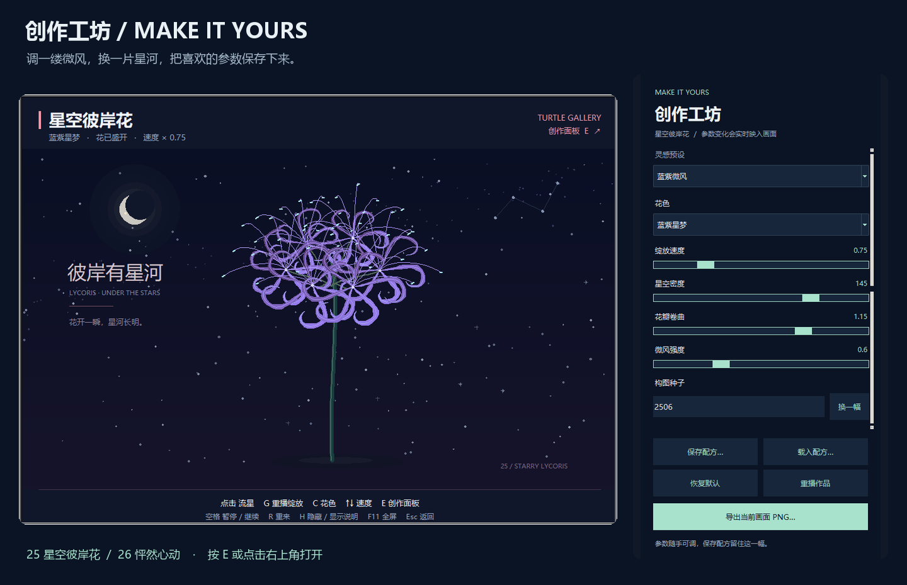

<div align="center">

# Turtle Gallery

**Draw an idea. Watch it come alive.**

14 interactive exhibits · 14 original experiments · Python Turtle / Tkinter

[Online gallery](https://zjh-b.github.io/turtle-gallery/) · [中文](README.md) · [Get started](#get-started) · [Explore](#explore-the-gallery) · [Creative guide](docs/CREATIVE_GUIDE.md)

[](https://github.com/zjh-b/turtle-gallery/actions/workflows/checks.yml)


</div>

Click to grow a spider lily beneath the stars, turn a brush stroke into a kaleidoscope, or watch a recursive tree move through four seasons. Turtle Gallery brings together animated scenes, small games and the original drawings and experiments that started the collection.

Made for club demonstrations, learning Python and trying out visual ideas. The artwork is drawn by code at runtime. **Running works, saving recipes and touring need only the Python standard library**, with no downloaded art assets or network connection. Optional PNG export requires Pillow.

**[Browse the online gallery →](https://zjh-b.github.io/turtle-gallery/)** Search, filter and explore every work on desktop or mobile. The website shows previews; download the project to run the interactive Python programs on your computer.

## Get started

Use **Python 3.9+ with Tkinter**. Download and extract the repository ZIP, then double-click **[start.bat](start.bat)** on Windows, or run:

```bash
git clone https://github.com/zjh-b/turtle-gallery.git
cd turtle-gallery
python run.py
```

Browse categories or search for an exhibit in the gallery. All 28 works share this entry point; the interface and in-app instructions are primarily in Chinese.

```bash
python run.py --list       # List all 28 works and their IDs
python run.py --demo 25    # Grow the starry spider lily
python run.py --demo 01    # Open the fireworks exhibit
python run.py --demo 18    # Watch the original Doraemon drawing
python run.py --tour 25,26,27 --seconds 30  # Loop through three works, 30 seconds each
python run.py --check      # Check dependencies and files without opening a window
```

Developed and checked on Windows. macOS and Linux need a Python build with Tk and a desktop display; their full GUI experience has not yet been verified. Use `python3` if that is your Python command. `--check` verifies dependencies and files, not display availability or GUI behavior.

## Explore the gallery


### Romantic Light · four new exhibits

Four new, interactive Python drawings explore visual themes familiar from short videos. The scenes are rendered by code at runtime. [Drawing notes and controls in Chinese →](docs/SOCIAL_DRAWINGS.md)


| ID | Exhibit / source | Try this |
| --- | --- | --- |
| 25 | [Starry Spider Lily](社团展示/25_星空彼岸花.py) | Click to send a meteor across the sky; G replays the bloom, C changes the flower color |
| 26 | [A Heart Made of Light](社团展示/26_怦然心动.py) | Click to scatter and regather the particle heart; C changes its colors, ↑↓ changes the beat |
| 27 | [A Rose in the Galaxy](社团展示/27_星河玫瑰.py) | Click to cast stardust; G replays growth, C changes the rose color |
| 28 | [Wings of Light](社团展示/28_霓光蝶舞.py) | Click to guide the butterfly toward light; M switches hovering and wandering, C changes colors |

### The original interactive exhibits


These ten exhibits and the four above make up the 14 interactive works.

| ID | Exhibit / source | Try this |
| --- | --- | --- |
| 01 | [Light Up the Night](社团展示/01_点击烟花.py) | Click for fireworks; C changes the pattern, F launches a five-rocket finale |
| 02 | [Pocket Universe](社团展示/02_旋转星系.py) | Select planets, inspect rings and moons, change speed with ↑↓ |
| 03 | [A Stroke in Bloom](社团展示/03_鼠标万花筒.py) | Drag to draw mirrored patterns; P changes colors, D toggles automatic drawing |
| 04 | [Quiet Koi Pond](社团展示/04_互动鱼塘.py) | Click to feed koi and watch them steer around one another |
| 05 | [Catch the Starlight](社团展示/05_接住星星.py) | Move with arrow keys; M toggles mouse control |
| 06 | [A Tree, Four Seasons](社团展示/06_四季分形树.py) | Choose a season with 1–4; G regrows the recursive branches |
| 07 | [Letters from the Deep](社团展示/07_深海水母.py) | Place a light for jellyfish to follow; C changes the palette |
| 08 | [Echoes in the Landscape](社团展示/08_山水画卷.py) | D switches day and night; click the lake to add a boat |
| 09 | [Circles Drawing Flowers](社团展示/09_几何绘图仪.py) | Pick a curve with 1–4; C redraws it with the moving pen |
| 10 | [Neon Breakout](社团展示/10_霓虹弹球.py) | Move with the mouse or arrows; A toggles automatic play |

Shared controls for all 14 exhibits: **Space** pause · **R** restart · **H** show/hide instructions · **F11** fullscreen · **Esc** exit the exhibit. In works 25 and 26, R keeps your current creation settings. When launched from the gallery, closing an exhibit lets you choose another. [Full controls in Chinese →](社团展示/README.md)

### Make the lily and heart your own

In **25 Starry Spider Lily** or **26 A Heart Made of Light**, press **E** or click **创作面板** at the top right to open the creation panel. Choose a preset, then adjust petal curvature, breeze and stars, or heart size and particle count with live sliders. **换一幅** generates a new composition while keeping the other settings. Save a JSON recipe and load it in the same exhibit next time.



Recipes store parameters and a composition seed; loading starts the work from the beginning. Animation progress and click history are not saved. **恢复默认** restores defaults, while **重播作品** restarts your current settings. The panel and [creation guide, sample recipes and measurements](docs/CREATION_GUIDE.md) are in Chinese.

To keep the current frame, click **导出当前画面 PNG…** in the panel. PNG export initially supports Windows and saves the artwork area at its current window resolution, reporting the actual dimensions and path. See the [optional dependency, steps and limits](docs/EXHIBITION_GUIDE.md#把当前画面保存为-png) in Chinese.

### 14 original experiments


Previews use runtime screenshots, with two exceptions: Kind Notes illustrates the original messages in a composed layout; the calculator card typesets actual program output.

The original filenames and drawing approaches remain in the repository root. Small scripts make useful starting points for understanding how a picture or an interaction works.

| Theme | Originals / source |
| --- | --- |
| Geometry and lines | 11 [Recursive Circles](2.py) · 12 [Rainbow Square Spiral](import%20turtle.py) · 14 [Arc Leaves](yeizi.py) · 15 [Arc Umbrella](yusan.py) |
| Draw something familiar | 13 [Red Heart](xin.py) · 17 [Random Fractal Tree](分形树.py) · 18 [Doraemon](哆啦A梦.py) |
| Make it move | 16 [Bouncing Balls](下落的小球.py) · 19 [Rotating Yin-Yang](太极.py) · 21 [Analog Clock](时钟.py) · 24 [Pinwheel](风车.py) |
| Everyday ideas and games | 20 [Kind Notes](弹窗.py) · 22 [Mooncake Packing Calculator](测试.py) · 23 [Needle Timing Game](见缝插针.py) |

Original scripts have their own controls. The needle game uses mouse clicks, the calculator accepts text input, and Kind Notes opens several small windows. Use the gallery's stop control to end an original. [Individual controls and editing ideas in Chinese →](docs/CREATIVE_GUIDE.md#14-个创意原作)

## Bring it to your club

Try **fireworks → a growing seasonal tree → audience doodles in the kaleidoscope → a breakout challenge → one small source edit**. H hides the instructions, F11 fills the screen, and Space pauses an interactive exhibit for explanation.

For an unattended display, use the desktop gallery to arrange a looping tour of **25, 26 and 27**, with 10–600 seconds per work (30 by default). Clicking or using regular artwork keys pauses automatic switching; **P** resumes the tour, **PgDn** advances, and **Esc** ends it. The gallery also has tour controls. See the [tour and PNG guide](docs/EXHIBITION_GUIDE.md) in Chinese.

Start by changing the heart's fill color in [xin.py](xin.py), or compare the [original fractal tree](分形树.py) with its [seasonal exhibit](社团展示/06_四季分形树.py) to see how one recursive idea grows into a scene.

For code entry points and small experiments, see the [creative guide](docs/CREATIVE_GUIDE.md). To add a work or report a problem, see [contributing](docs/CONTRIBUTING.md) and [Issues](https://github.com/zjh-b/turtle-gallery/issues). These detailed guides are currently in Chinese.

The [development roadmap](docs/ROADMAP.md) records completed and planned work with acceptance criteria. M1 provides creation panels, saved recipes and refined lily rendering. M2 is in progress with exhibition playlists and PNG snapshots; additional aspect ratios, large images redrawn at their target size, video export and browser interaction remain planned.
