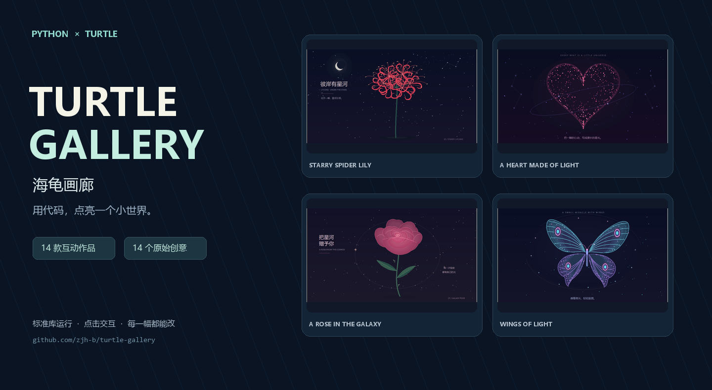
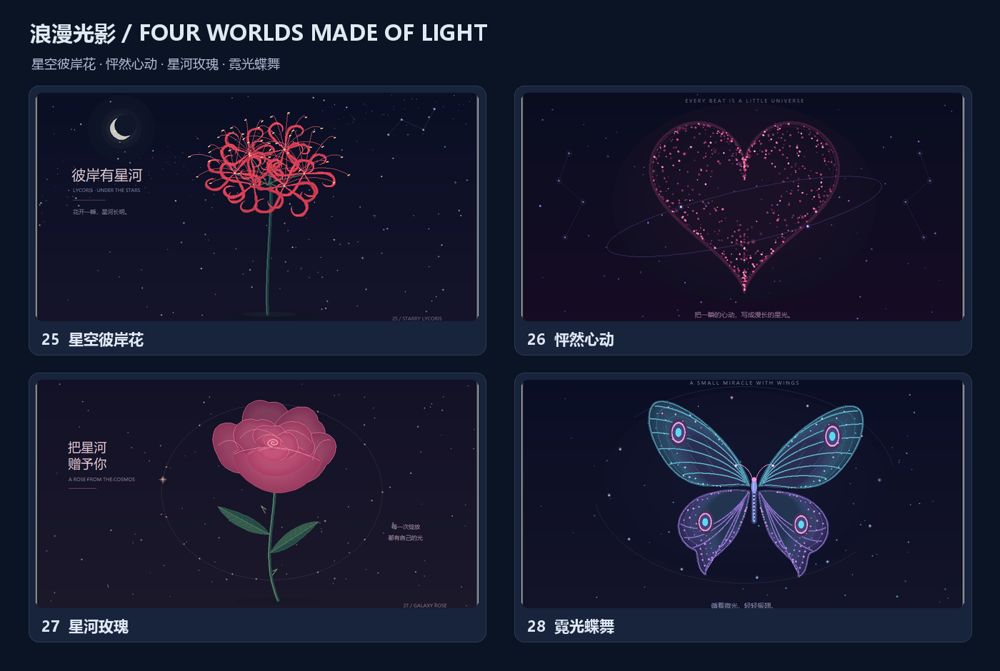
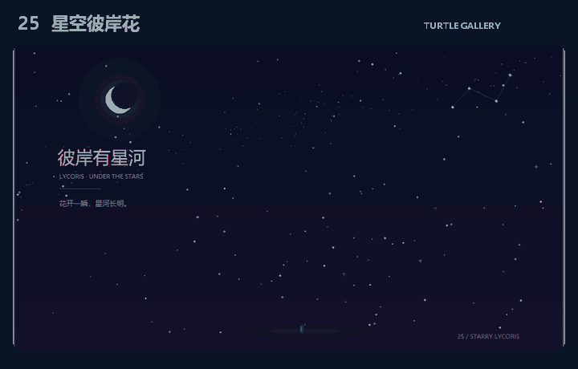
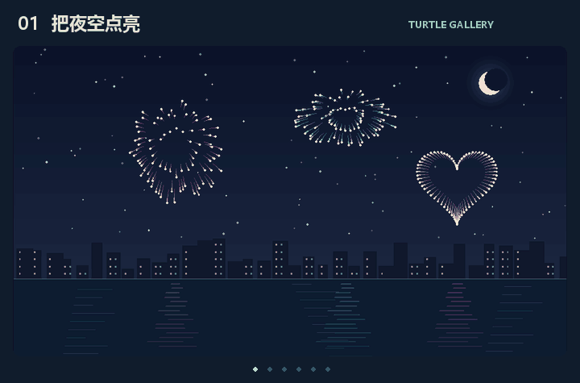
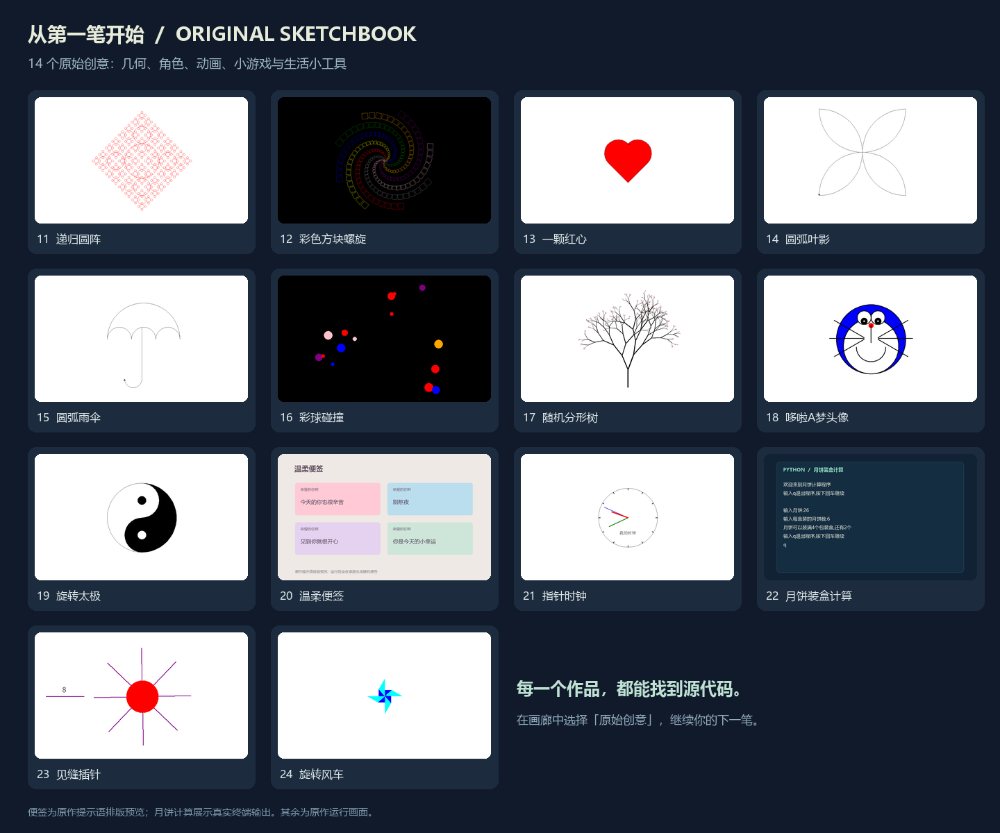

<div align="center">

# Turtle Gallery · 海龟画廊

**用 Python，把灵感画出来。**

14 款互动展品 · 14 个创意原作 · 一个可以逛、可以玩、可以改的代码画廊

[在线逛画廊](https://zjh-b.github.io/turtle-gallery/) · [English](README.en.md) · [开始体验](#开始体验) · [全部作品](#逛一逛画廊) · [创作指南](docs/CREATIVE_GUIDE.md) · [升级路线](docs/ROADMAP.md)

[](https://github.com/zjh-b/turtle-gallery/actions/workflows/checks.yml)



</div>

点一下，星空里开出彼岸花；画一笔，线条变成花瓣；换个参数，树梢走过四季。这里收录了用 **Python Turtle / Tkinter** 制作的绘画、动画和小游戏，也保留了从爱心、雨伞、时钟到月饼计算的小创意。

适合社团展示、编程入门和创意实验。画面由代码实时绘制，运行只用 Python 标准库，无需下载素材或连接网络。

**[先在线逛一逛 →](https://zjh-b.github.io/turtle-gallery/)** 支持手机浏览、作品搜索、分类筛选和源码直达。网页展示预览；下载项目后，即可在电脑上运行互动作品。

## 开始体验

准备 **Python 3.9 或更新版本**，并确保安装了 Tkinter。下载本仓库 ZIP 并解压，Windows 用户可双击根目录的 **[start.bat](start.bat)**。

也可以使用终端：

```bash
git clone https://github.com/zjh-b/turtle-gallery.git
cd turtle-gallery
python run.py
```

打开画廊后选择作品；可按分类浏览，也可以搜索作品。原作与互动展品都能从同一个入口启动。

```bash
python run.py --list       # 列出全部 28 款作品与编号
python run.py --demo 25    # 看星空彼岸花逐渐绽放
python run.py --demo 01    # 直接体验点击烟花
python run.py --demo 18    # 看海龟逐笔画出哆啦 A 梦
python run.py --check      # 检查环境和作品文件，不打开窗口
```

当前在 Windows 上开发和验证。macOS / Linux 需要带 Tk 的 Python 和桌面显示环境，完整界面体验尚待这些平台验证；若系统命令是 `python3`，替换上面的 `python` 即可。`--check` 检查依赖和文件，不能代替实际打开 GUI。

## 逛一逛画廊



### 浪漫光影 · 新增四款

把短视频中常见的星空、花朵、爱心与蝶翼题材重新设计成可交互的 Python 绘图。每一帧由代码实时生成。[查看四款作品的改动入口与展示建议 →](docs/SOCIAL_DRAWINGS.md)



| 编号 | 作品 / 源码 | 可以怎么玩 |
| --- | --- | --- |
| 25 | [星空彼岸花](社团展示/25_星空彼岸花.py) | 点击落下一颗流星；G 重播花朵绽放，C 换花色 |
| 26 | [怦然心动](社团展示/26_怦然心动.py) | 点击让粒子爱心散开再聚合；C 换色，↑↓ 调心跳 |
| 27 | [星河玫瑰](社团展示/27_星河玫瑰.py) | 点击洒星尘；G 看花瓣生长，C 换花色 |
| 28 | [霓光蝶舞](社团展示/28_霓光蝶舞.py) | 点击引蝶追光；M 切换悬停与漫游，C 换色 |

### 原有互动作品



以下 10 款与新增 4 款组成 14 款互动展品。

| 编号 | 作品 / 源码 | 可以怎么玩 |
| --- | --- | --- |
| 01 | [把夜空点亮](社团展示/01_点击烟花.py) | 点击放烟花；C 换花型，F 五束齐放，看湖面倒影 |
| 02 | [口袋里的宇宙](社团展示/02_旋转星系.py) | 点选星球，观察星环与卫星，↑↓ 调整公转速度 |
| 03 | [一笔生花](社团展示/03_鼠标万花筒.py) | 拖动画出对称图案，P 换配色，D 切换自动绘画 |
| 04 | [清浅荷塘](社团展示/04_互动鱼塘.py) | 点击投喂，观察锦鲤摆尾与鱼群避让 |
| 05 | [把星光装进口袋](社团展示/05_接住星星.py) | 用方向键接星星；M 切换鼠标控制，挑战分数 |
| 06 | [一树四季](社团展示/06_四季分形树.py) | 1～4 切换季节，G 观看枝条递归生长 |
| 07 | [深海来信](社团展示/07_深海水母.py) | 点击留下光点，让水母靠近；C 切换海底配色 |
| 08 | [山水有回声](社团展示/08_山水画卷.py) | D 切换昼夜，点击湖面添一叶小舟 |
| 09 | [圆在画花](社团展示/09_几何绘图仪.py) | 1～4 选曲线，C 重绘，观察圆盘与偏心画笔 |
| 10 | [霓虹弹球](社团展示/10_霓虹弹球.py) | 鼠标或方向键打砖块；A 开启自动演示 |

这 14 款作品共用操作：**空格暂停 · R 重来 · H 隐藏说明 · F11 全屏 · Esc 退出作品**。从画廊启动时，退出后可继续选下一款。[详细操作与展示顺序 →](社团展示/README.md)

### 14 个创意原作



预览以运行截图为主；温柔便签使用原文排版示意，月饼计算展示实际程序输出的排版。

小作品也是这座画廊的一部分。原来的文件名和画法保留在根目录，方便看懂一个创意怎样从几行代码开始。

| 方向 | 原作 / 源码 |
| --- | --- |
| 几何与线条 | 11 [递归圆阵](2.py) · 12 [彩色方块螺旋](import%20turtle.py) · 14 [圆弧叶影](yeizi.py) · 15 [圆弧雨伞](yusan.py) |
| 画出喜欢的东西 | 13 [一颗红心](xin.py) · 17 [随机分形树](分形树.py) · 18 [哆啦 A 梦](哆啦A梦.py) |
| 让画面动起来 | 16 [彩球碰撞](下落的小球.py) · 19 [旋转太极](太极.py) · 21 [指针时钟](时钟.py) · 24 [风车](风车.py) |
| 日常与游戏 | 20 [温柔便签](弹窗.py) · 22 [月饼计算](测试.py) · 23 [见缝插针](见缝插针.py) |

原作的操作各不相同：见缝插针用鼠标点击，月饼计算用文字输入，温柔便签会陆续出现多个小窗口。画廊提供停止作品的入口。[查看全部原作的操作与修改建议 →](docs/CREATIVE_GUIDE.md#14-个创意原作)

## 带它去做一次展示

一个容易上手的顺序：**星空彼岸花开场 → 四季树讲递归 → 万花筒请同学画一笔 → 怦然心动请观众点击 → 弹球挑战 → 打开原作源码改一个参数**。按 H 收起说明、F11 全屏，适合投影；想讲解时按空格暂停画面。

从 [xin.py](xin.py) 的爱心填色开始，或把 [分形树.py](分形树.py) 与 [四季分形树](社团展示/06_四季分形树.py) 放在一起看：同一个递归想法，可以逐步长出颜色、风和交互。

## 继续创作

- [升级路线](docs/ROADMAP.md)：参数创作、作品导出、现场巡展与在线试玩的优先级、试点和完成标准。
- [创作指南](docs/CREATIVE_GUIDE.md)：28 款作品的代码入口、原作操作和几个可以立刻动手的改法。
- [贡献指南](docs/CONTRIBUTING.md)：添加作品、报告问题和提交改进。
- [Issues](https://github.com/zjh-b/turtle-gallery/issues)：分享运行问题或你想看到的下一个小世界。

```text
turtle-gallery/
├── run.py                 # 统一入口：画廊、作品列表、直接启动、环境检查
├── start.bat              # Windows 双击启动
├── *.py                   # 14 个创意原作
├── 社团展示/               # 14 款互动作品、共用舞台与预览
└── docs/                  # 在线画廊、创作指南与真实运行预览
```
