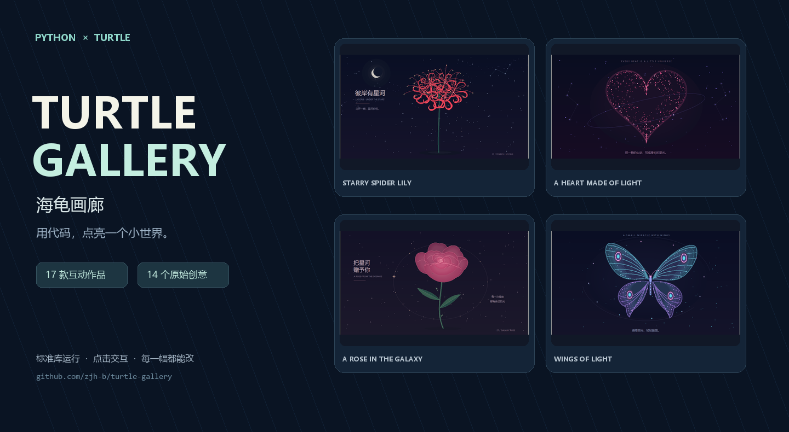
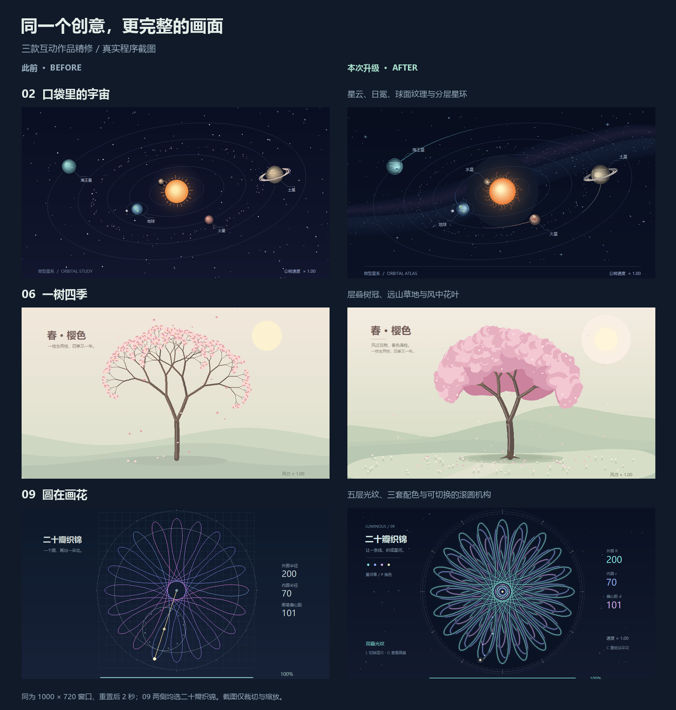
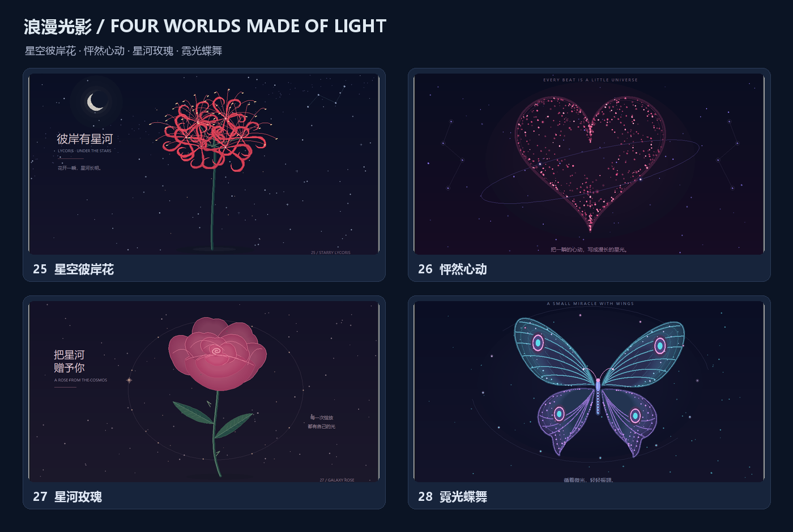
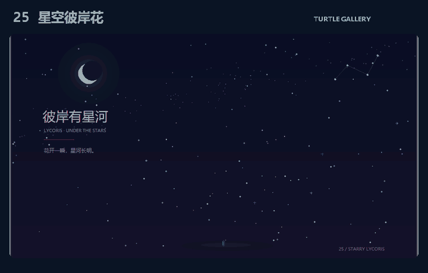
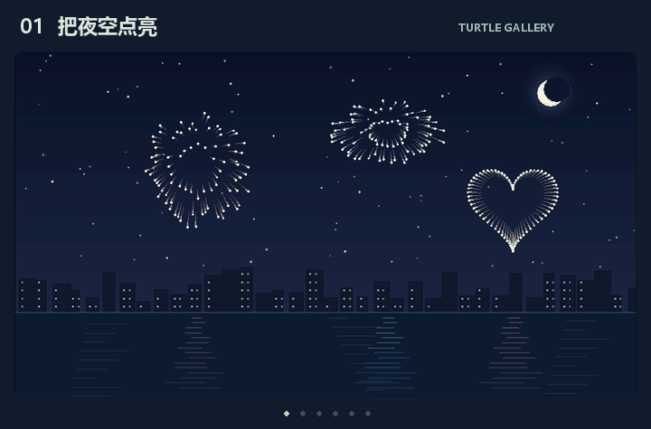
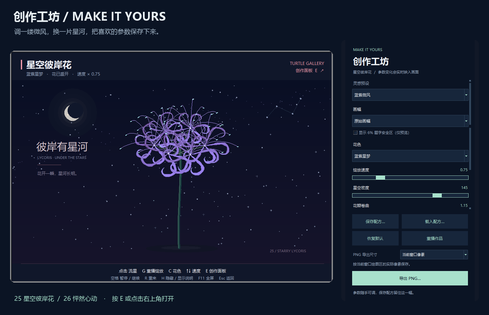
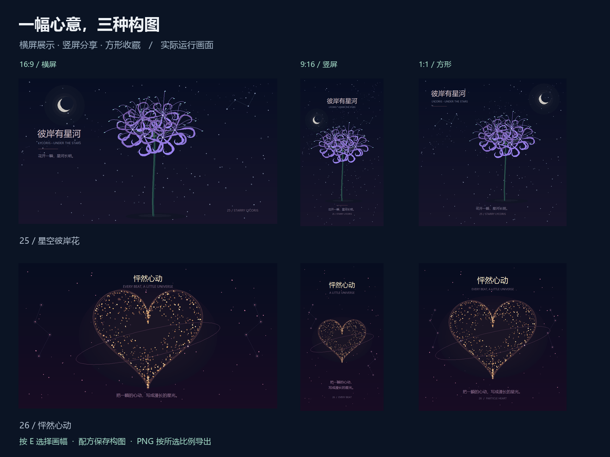
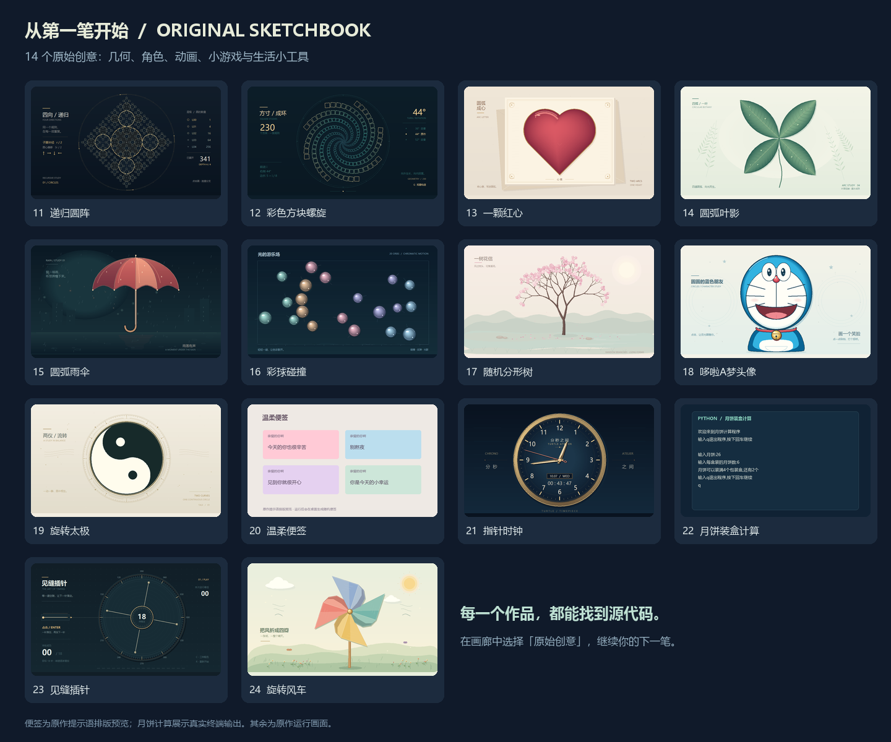

<div align="center">

# Turtle Gallery · 海龟画廊

**用 Python，把灵感画出来。**

14 款互动展品 · 14 个创意原作 · 一个可以逛、可以玩、可以改的代码画廊

[在线放烟花](https://zjh-b.github.io/turtle-gallery/play/fireworks.html) · [在线一笔生花](https://zjh-b.github.io/turtle-gallery/play/kaleidoscope.html) · [在线怦然心动](https://zjh-b.github.io/turtle-gallery/play/heart.html) · [在线逛画廊](https://zjh-b.github.io/turtle-gallery/) · [English](README.en.md) · [开始体验](#开始体验) · [全部作品](#逛一逛画廊) · [创作指南](docs/CREATIVE_GUIDE.md) · [升级路线](docs/ROADMAP.md)

[](https://github.com/zjh-b/turtle-gallery/actions/workflows/checks.yml)



</div>

点一下，星空里开出彼岸花；画一笔，线条变成花瓣；换个参数，树梢走过四季。这里收录了用 **Python Turtle / Tkinter** 制作的绘画、动画和小游戏，也保留了从爱心、雨伞、时钟到月饼计算的小创意。

适合社团展示、编程入门和创意实验。画面由代码实时绘制，桌面作品、配方和巡展只用 Python 标准库，无需下载素材或连接网络；桌面可选 PNG 导出需另装 Pillow。

**[直接在线放烟花 →](https://zjh-b.github.io/turtle-gallery/play/fireworks.html)** 无需安装，点击或轻触夜空，选择四种花型与配色，也可用键盘操作。首次打开呈现静态烟花，自动表演需手动开启；提供暂停、重置和减少动态效果。[玩法说明 →](docs/BROWSER_PLAY.md)

**[在线一笔生花 →](https://zjh-b.github.io/turtle-gallery/play/kaleidoscope.html)** 先看一朵静态示例花，再点“开始手绘”，用鼠标、触笔或单指画出对称图案。选择 3–16 份对称与三种配色，按整笔撤销，或将作品下载为 1080 × 1080 PNG；浏览器内完成，无需安装依赖。[玩法与触摸说明 →](docs/BROWSER_PLAY.md#03-一笔生花)

**[在线怦然心动 →](https://zjh-b.github.io/turtle-gallery/play/heart.html)** 轻触，让粒子爱心散成星尘，再慢慢相聚。选择三种主题、420 / 680 / 1000 粒星尘与 0.45–1.8 倍心跳，暂停在喜欢的一刻，保存 1080 × 1080 PNG。首次打开保持静态，主动播放或点击后开始心跳；开启减少动态效果后，点击切换静态散开与聚合。重置会暂停并保留参数，保存图片不改变播放状态。[玩法与保存说明 →](docs/BROWSER_PLAY.md#26-怦然心动)

[在线画廊](https://zjh-b.github.io/turtle-gallery/) 支持手机浏览、作品搜索、分类筛选和源码直达。目前 01 烟花、03 万花筒、26 粒子爱心支持在线试玩，其余作品提供预览；下载项目后可在电脑上运行全部 28 款作品。

想快速开始，可直接打开 **[在线试玩合集 →](https://zjh-b.github.io/turtle-gallery/?collection=online#gallery)**。搜索或切换分类后，点击“复制当前筛选链接”，就能把这组作品分享给社团同学；刷新和浏览器前进 / 后退也会恢复对应筛选。浏览器不允许自动复制时，页面会提供可手动复制的链接。

## 开始体验

准备 **Python 3.9 或更新版本**，并确保安装了 Tkinter。下载本仓库 ZIP 并解压，Windows 用户可双击根目录的 **[start.bat](start.bat)**。

也可以使用终端：

```bash
git clone https://github.com/zjh-b/turtle-gallery.git
cd turtle-gallery
python run.py
```

打开画廊后选择作品；可按分类浏览，也可以搜索作品。原作与互动展品都能从同一个入口启动。

```bash
python run.py --list       # 列出全部 28 款作品与编号
python run.py --demo 25    # 看星空彼岸花逐渐绽放
python run.py --demo 01    # 直接体验点击烟花
python run.py --demo 18    # 看海龟逐笔画出哆啦 A 梦
python run.py --tour 25,26,27 --seconds 30  # 三件作品循环巡展，每件 30 秒
python run.py --check      # 检查环境和作品文件，不打开窗口
```

当前在 Windows 上开发和验证。macOS / Linux 需要带 Tk 的 Python 和桌面显示环境，完整界面体验尚待这些平台验证；若系统命令是 `python3`，替换上面的 `python` 即可。`--check` 检查依赖和文件，不能代替实际打开 GUI。

## 逛一逛画廊

### 三款作品画面升级



**02 口袋里的宇宙** 加入星云微尘、流动日冕与更细致的行星材质；**06 一树四季** 以层叠树冠、远山和草地呈现四季，点击即可唤起一阵风；**09 圆在画花** 默认展示五层二十瓣织锦，按 **P** 换三种配色、**L** 比较单线与叠层、**G** 查看滚圆原理。

在电脑上运行 `python run.py --demo 02`、`--demo 06` 或 `--demo 09` 体验。[查看画面对照与展示玩法 →](docs/VISUAL_UPGRADES.md)



### 浪漫光影 · 新增四款

把短视频中常见的星空、花朵、爱心与蝶翼题材重新设计成可交互的 Python 绘图。每一帧由代码实时生成。[查看四款作品的改动入口与展示建议 →](docs/SOCIAL_DRAWINGS.md)



| 编号 | 作品 / 源码 | 可以怎么玩 |
| --- | --- | --- |
| 25 | [星空彼岸花](社团展示/25_星空彼岸花.py) | 点击落下一颗流星；G 重播花朵绽放，C 换花色 |
| 26 | [怦然心动](社团展示/26_怦然心动.py) · [在线试玩](https://zjh-b.github.io/turtle-gallery/play/heart.html) | 点击让粒子爱心散开再聚合；网页可调色、调速与保存 PNG；桌面版 C 换色，↑↓ 调心跳 |
| 27 | [星河玫瑰](社团展示/27_星河玫瑰.py) | 点击洒星尘；G 看花瓣生长，C 换花色 |
| 28 | [霓光蝶舞](社团展示/28_霓光蝶舞.py) | 点击引蝶追光；M 切换悬停与漫游，C 换色 |

### 原有互动作品



以下 10 款与新增 4 款组成 14 款互动展品。

| 编号 | 作品 / 源码 | 可以怎么玩 |
| --- | --- | --- |
| 01 | [把夜空点亮](社团展示/01_点击烟花.py) · [在线试玩](https://zjh-b.github.io/turtle-gallery/play/fireworks.html) | 点击放烟花；桌面版 C 换花型，F 五束齐放，看湖面倒影 |
| 02 | [口袋里的宇宙](社团展示/02_旋转星系.py) | 点选星球，观察日冕、云层与分层星环，↑↓ 调整公转速度 |
| 03 | [一笔生花](社团展示/03_鼠标万花筒.py) · [在线试玩](https://zjh-b.github.io/turtle-gallery/play/kaleidoscope.html) | 拖动画出对称图案；网页版可撤销与下载 PNG，桌面版 P 换配色、D 切换自动绘画 |
| 04 | [清浅荷塘](社团展示/04_互动鱼塘.py) | 点击投喂，观察锦鲤摆尾与鱼群避让 |
| 05 | [把星光装进口袋](社团展示/05_接住星星.py) | 用方向键接星星；M 切换鼠标控制，挑战分数 |
| 06 | [一树四季](社团展示/06_四季分形树.py) | 1～4 比较春花、浓荫、金叶与雪枝；点击唤风，G 观看递归生长 |
| 07 | [深海来信](社团展示/07_深海水母.py) | 点击留下光点，让水母靠近；C 切换海底配色 |
| 08 | [山水有回声](社团展示/08_山水画卷.py) | D 切换昼夜，点击湖面添一叶小舟 |
| 09 | [圆在画花](社团展示/09_几何绘图仪.py) | 1～4 选曲线，P 换配色，L 单线/叠层，C 重绘，G 查看圆盘 |
| 10 | [霓虹弹球](社团展示/10_霓虹弹球.py) | 鼠标或方向键打砖块；A 开启自动演示 |

这 14 款作品共用操作：**空格暂停 · R 重来 · H 隐藏说明 · F11 全屏 · Esc 退出作品**。25、26 的 R 会保留当前创作参数重新播放。从画廊启动时，退出后可继续选下一款。[详细操作与展示顺序 →](社团展示/README.md)

### 调出自己的彼岸花与粒子爱心

在 **25 星空彼岸花** 或 **26 怦然心动** 中按 **E**，或点击画面右上角的 **创作面板**：选一套预设，拖动滑块改变花瓣卷曲、微风、星空密度或爱心大小与粒子数量。点击“换一幅”探索新构图，满意后保存 JSON 配方，下次在同一作品中载入。



配方保存参数与构图种子，载入后从头播放；动画进度和点击过程不在其中。面板里的“恢复默认”与“重播作品”分别用于回到初始设置和重播当前创作。[创作步骤、示例配方与实测结果 →](docs/CREATION_GUIDE.md)

想保存眼前这一帧，在面板选择 **PNG 导出尺寸**，再点击 **导出 PNG…**。默认按当前窗口像素保存；选择固定画幅后，可用 **高清重绘 · 1080 / 2160** 从小窗口导出大作品。后台导出可取消，完成后显示尺寸与路径。首批支持 Windows，需安装可选 Pillow 依赖，高清模式还需微软雅黑字体。[安装依赖、导出步骤与限制 →](docs/EXHIBITION_GUIDE.md#把当前画面保存为-png)

**一幅作品，三种构图。** 在面板选择 **横屏 16:9、竖屏 9:16 或方形 1:1**，主体与题字会重新排布；可打开题字安全区参考线。PNG 按所选比例导出，配方也会记住画幅。原有配方继续按原始构图载入。



| 画幅 | 高清重绘 · 1080 | 高清重绘 · 2160 |
| --- | --- | --- |
| 横屏 16:9 | 1920 × 1080 | 3840 × 2160 |
| 竖屏 9:16 | 1080 × 1920 | 2160 × 3840 |
| 方形 1:1 | 1080 × 1080 | 2160 × 2160 |

高清模式固定当前构图与动画进度，按目标尺寸重新绘制线条和文字。[查看细节对照](docs/assets/hd-export-comparison.png) · [打开实际 4K PNG](docs/assets/export-lily-4k.png)

### 14 个创意原作



预览以运行截图为主；温柔便签使用原文排版示意，月饼计算展示实际程序输出的排版。

小作品也是这座画廊的一部分。根目录保留原来的文件名与创作主题，部分作品继续在原文件中升级；早期版本可通过 Git 历史查看。

**原文件焕新：14 圆弧叶影、15 圆弧雨伞、24 风车。** 叶片加入渐变叶面、细密叶脉与露珠；雨伞置于雨夜，增加织物光影、水面倒影和涟漪；风车升级为折纸叶片与花园微风。三款都可用 **C** 换配色，以及空格暂停、R 重来、H 收起说明、F11 全屏、Esc 退出。


在项目根目录运行 `python yeizi.py`、`python yusan.py` 或 `python 风车.py`。请保留项目中的 `社团展示/` 共用模块。[查看前后对照与互动玩法 →](docs/ORIGINAL_UPGRADES.md)

| 方向 | 原作 / 源码 |
| --- | --- |
| 几何与线条 | 11 [递归圆阵](2.py) · 12 [彩色方块螺旋](import%20turtle.py) · 14 [圆弧叶影](yeizi.py) · 15 [圆弧雨伞](yusan.py) |
| 画出喜欢的东西 | 13 [一颗红心](xin.py) · 17 [随机分形树](分形树.py) · 18 [哆啦 A 梦](哆啦A梦.py) |
| 让画面动起来 | 16 [彩球碰撞](下落的小球.py) · 19 [旋转太极](太极.py) · 21 [指针时钟](时钟.py) · 24 [风车](风车.py) |
| 日常与游戏 | 20 [温柔便签](弹窗.py) · 22 [月饼计算](测试.py) · 23 [见缝插针](见缝插针.py) |

14、15、24 仍归入“创意原稿”，并已接入通用舞台操作：点击叶面落露、点击雨伞下方水面泛起涟漪、点击风车画面唤风。其余原作按各自说明体验：见缝插针用鼠标点击，月饼计算用文字输入，温柔便签会陆续出现多个小窗口。画廊提供停止作品的入口。[查看全部原作的操作与修改建议 →](docs/CREATIVE_GUIDE.md#14-个创意原作)

## 带它去做一次展示

一个容易上手的顺序：**星空彼岸花开场 → 四季树讲递归 → 万花筒请同学画一笔 → 怦然心动请观众点击 → 弹球挑战 → 打开原作源码改一个参数**。按 H 收起说明、F11 全屏，适合投影；想讲解时按空格暂停画面。

无人操作时，可从桌面画廊设置 **25 → 26 → 27** 自动巡展，调整顺序和每件停留时间。点击或按普通操作键后暂停切换，**P** 继续巡展，**PgDn** 下一件，**Esc** 结束。[巡展控制与 PNG 导出指南 →](docs/EXHIBITION_GUIDE.md)

从 [xin.py](xin.py) 的爱心填色开始，或把 [分形树.py](分形树.py) 与 [四季分形树](社团展示/06_四季分形树.py) 放在一起看：同一个递归想法，可以逐步长出颜色、风和交互。

## 继续创作

- [创作面板与配方](docs/CREATION_GUIDE.md)：为彼岸花、粒子爱心调参，保存、分享和恢复自己的构图。
- [巡展与 PNG 导出](docs/EXHIBITION_GUIDE.md)：设置三作品循环展示，人工接管，再带走当前画面。
- [在线试玩玩法](docs/BROWSER_PLAY.md)：打开网页放烟花、画万花筒，或让粒子爱心散开再相聚；万花筒与爱心可保存 PNG。
- [升级路线](docs/ROADMAP.md)：M1 已完成；M2 已接入巡展、三种画幅和高清 PNG，十分钟连续验收与短片仍待完成；M3 已接入烟花、万花筒与粒子爱心，手机实机、Safari 与 Firefox 验收待完成。
- [创作指南](docs/CREATIVE_GUIDE.md)：28 款作品的代码入口、原作操作和几个可以立刻动手的改法。
- [贡献指南](docs/CONTRIBUTING.md)：添加作品、报告问题和提交改进。
- [Issues](https://github.com/zjh-b/turtle-gallery/issues)：分享运行问题或你想看到的下一个小世界。

```text
turtle-gallery/
├── run.py                 # 统一入口：画廊、作品列表、直接启动、环境检查
├── start.bat              # Windows 双击启动
├── *.py                   # 14 个创意原作
├── 社团展示/               # 14 款互动作品、共用舞台与预览
└── docs/                  # 在线画廊、创作指南与真实运行预览
```
