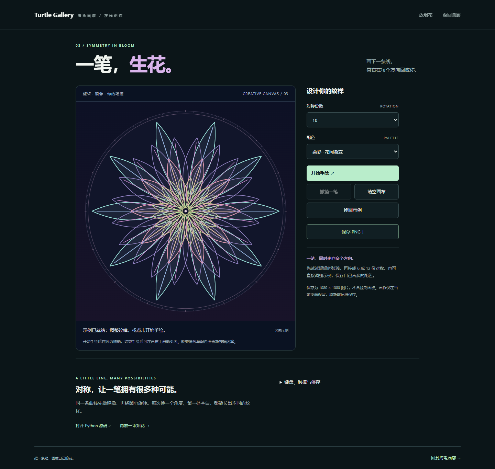

# 在线试玩：烟花与一笔生花

[在线放烟花 →](https://zjh-b.github.io/turtle-gallery/play/fireworks.html) · [在线一笔生花 →](https://zjh-b.github.io/turtle-gallery/play/kaleidoscope.html) · [返回画廊](https://zjh-b.github.io/turtle-gallery/) · [下载与运行 Python 作品](../README.md#开始体验)

点一下夜空放烟花，或画一笔，让线条在圆中开成花。**01 把夜空点亮** 与 **03 一笔生花** 提供浏览器试玩，无需安装。其他作品可在画廊看预览，下载后在电脑运行。

## 01 把夜空点亮

### 怎么玩

点击或轻触夜空，松手后发射。选择礼花、星环、爱心或金柳，再选一套配色，下一束烟花就会用上。也可以点击“放一束烟花”或“让烟花齐放”。手机上滑动仍可正常浏览页面。

首次打开是静态夜空。点击发射或“播放动画”后开始运动；“自动表演”默认关闭，开启后持续发射。可随时暂停，或用“重置夜空”回到初始静态画面并关闭自动表演。

用 Tab 将焦点移到画布后，可使用以下快捷键；选择框和按钮也支持键盘操作。

| 按键 | 操作 |
| --- | --- |
| Enter | 放一束烟花 |
| F | 烟花齐放 |
| Space | 播放 / 暂停 |
| A | 开关自动表演 |
| R | 重置夜空 |

### 减少动态效果

页面会读取系统的减少动态效果偏好，也可手动勾选同名选项。启用后，每次点击直接显示静态绽放，自动表演关闭。页面隐藏或离开时停止绘制，返回后按原有播放状态继续。

若脚本、绘图或配置加载失败，页面保留静态预览、Python 源码和下载入口。浏览器版与桌面版保留相同烟花主题和运动规律，随机分布及绘制细节可能不同；桌面版可用 `python run.py --demo 01` 打开。

## 03 一笔生花

[开始创作 →](https://zjh-b.github.io/turtle-gallery/play/kaleidoscope.html)

打开页面先看到一朵静态示例花。调整 **3–16 份对称** 或选择 **三种配色**，已有笔迹也会随之变化。页面只响应你的操作，没有自动绘画或持续播放的动画。

### 画一笔，再改一改

1. 点击“开始手绘”，进入绘画模式。示例花会被清除；退出后再次开始，会保留自己已经画好的笔迹。
2. 在圆内用鼠标、触笔或单指按下并拖动，松手完成一笔。线条会同时旋转、镜像，形成对称图案。
3. 调整对称份数与配色，或按整笔撤销。“清空”立即移除当前所有笔迹；“换回示例”立即用示例花替换当前作品并退出绘画模式。
4. 下载 PNG，获得 **1080 × 1080** 的方形图片，包含作品与边框，不包含光标和操作提示。

示例、参数和所有按钮均可用键盘操作，不手绘也能调整示例花并下载。桌面版的 P 换色、D 自动绘画快捷键不用于网页；桌面作品可用 `python run.py --demo 03` 打开。

### 在手机上画与滚动

未开始手绘时，在画布上滑动可以浏览页面。进入绘画模式后，画布接收单指绘画；退出绘画模式后，画布恢复页面滚动与缩放。

当前一笔移出圆形范围、触摸被系统取消、出现第二个触点、窗口失焦或页面进入后台时，未完成的整笔会被取消，已经完成的笔迹保留。重新按下才能开始下一笔，返回画布不会突然连出一条长线。

### 保存与数量上限

最多保留 **60 笔、合计 2400 个采样点，每笔最多 400 点**。达到上限会提示操作，已有笔迹不会被自动丢弃；撤销或清空后可继续创作。

PNG 在浏览器中生成并通过浏览器下载，不上传图片，不需要 Pillow、账号或后端服务。更改对称或配色后可再次下载。页面的静态预览、Python 源码与下载入口在脚本、绘图或配置加载失败时仍保留。

## 验证范围

M3 仍在进行中。01 烟花此前在 Windows 上通过 Edge 154 的 6 组浏览器检查，桌面浏览器和移动设备模拟覆盖点击、键盘、触摸取消、多点触摸、页面滚动、暂停、减少动态效果、后台恢复与加载失败降级；详见[烟花实测记录](benchmarks/browser-m3.json)和[检查方法](CONTRIBUTING.md#维护在线烟花)。

03 万花筒在 Edge 154 通过 7 组浏览器检查，涵盖手绘、整笔撤销、参数重绘、缓存一致性、数量上限、PNG 尺寸与内容、移动触摸及异常取消、无脚本与配置失败降级；13 项万花筒模型测试也已通过。本轮结果见[万花筒实测记录](benchmarks/kaleidoscope-m3.json)，复现步骤见[维护在线万花筒](CONTRIBUTING.md#维护在线万花筒)。**真实手机验收尚未完成**，Safari 与 Firefox 也尚未实测。移动设备模拟不能替代手机实机验收。
