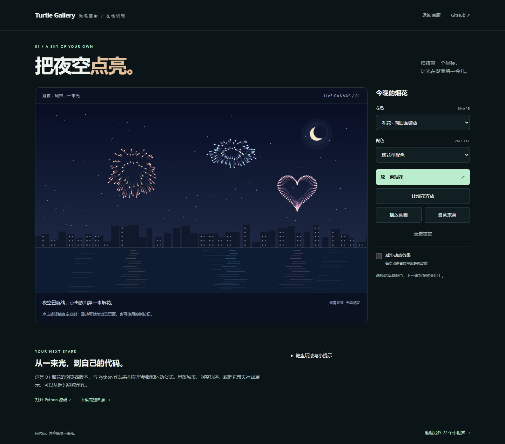

# 在线放烟花

[立即试玩 →](https://zjh-b.github.io/turtle-gallery/play/fireworks.html) · [返回画廊](https://zjh-b.github.io/turtle-gallery/) · [下载与运行 Python 作品](../README.md#开始体验)

点一下夜空，让烟花在城市与湖面之间绽放。无需安装；目前只有 **01 把夜空点亮** 提供浏览器试玩，其他作品可在画廊看预览，下载后在电脑运行。

## 怎么玩

点击或轻触夜空，松手后发射。选择礼花、星环、爱心或金柳，再选一套配色，下一束烟花就会用上。也可以点击“放一束烟花”或“让烟花齐放”。手机上滑动仍可正常浏览页面。

首次打开是静态夜空。点击发射或“播放动画”后开始运动；“自动表演”默认关闭，开启后持续发射。可随时暂停，或用“重置夜空”回到初始静态画面并关闭自动表演。

用 Tab 将焦点移到画布后，可使用以下快捷键；选择框和按钮也支持键盘操作。

| 按键 | 操作 |
| --- | --- |
| Enter | 放一束烟花 |
| F | 烟花齐放 |
| Space | 播放 / 暂停 |
| A | 开关自动表演 |
| R | 重置夜空 |

## 减少动态效果

页面会读取系统的减少动态效果偏好，也可手动勾选同名选项。启用后，每次点击直接显示静态绽放，自动表演关闭。页面隐藏或离开时停止绘制，返回后按原有播放状态继续。

若脚本、绘图或配置加载失败，页面保留静态预览、Python 源码和下载入口。浏览器版与桌面版保留相同烟花主题和运动规律，随机分布及绘制细节可能不同；桌面版可用 `python run.py --demo 01` 打开。

## 验证范围

M3 仍在进行中。Windows 上 Edge 154 的 6 组浏览器检查已通过，桌面浏览器和移动设备模拟覆盖点击、键盘、触摸取消、多点触摸、页面滚动、暂停、减少动态效果、后台恢复与加载失败降级；**真实手机验收尚未完成**。Safari 与 Firefox 也尚未实测。详见[实测记录](benchmarks/browser-m3.json)和[检查方法](CONTRIBUTING.md#维护在线烟花)。
