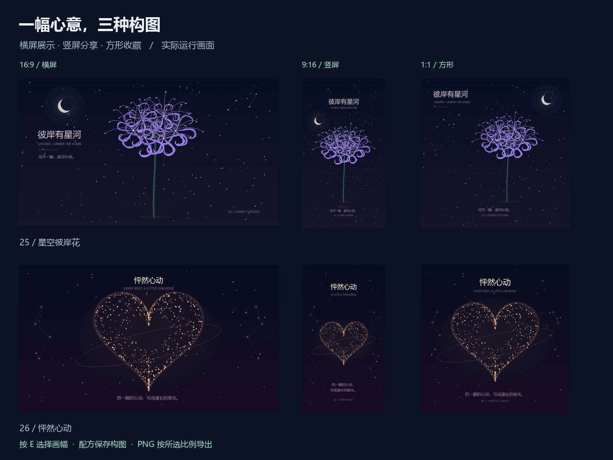
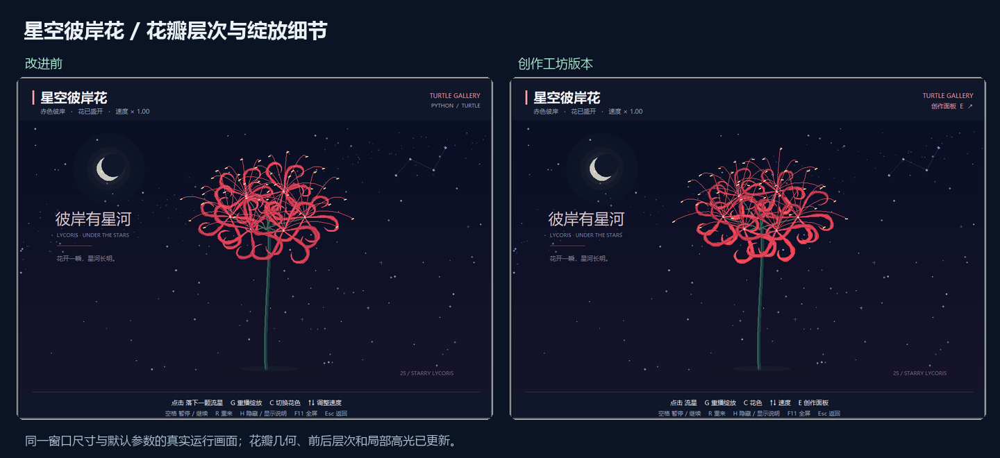

# 把画面调成自己的作品

[返回项目首页](../README.md) · [巡展与 PNG 导出](EXHIBITION_GUIDE.md) · [浪漫光影](SOCIAL_DRAWINGS.md) · [升级路线](ROADMAP.md) · [修改代码](CREATIVE_GUIDE.md)

**25 星空彼岸花** 与 **26 怦然心动** 已支持创作面板、横屏 / 竖屏 / 方形构图、JSON 配方和当前画面 PNG。可以从预设开始，用滑块调整画面，再保存这组参数，交给另一位同学或下次重新打开。运行作品、保存配方和巡展只需要 Python 标准库中的 Turtle / Tkinter；可选 PNG 导出需另装 Pillow，首批支持 Windows。


## 完成第一幅创作

1. 在项目根目录运行 `python run.py --demo 25`，或从桌面画廊打开星空彼岸花。粒子爱心使用 `python run.py --demo 26`。
2. 按 **E** 或点击作品右上角 **创作面板**。面板可滚动，作品窗口继续显示动画。
3. 在“画幅”中选择原始画幅、横屏 16:9、竖屏 9:16 或方形 1:1，再选一个“灵感预设”并调整颜色和滑块。彼岸花可改变花瓣卷曲、微风和星空密度；爱心可改变粒子数量、大小与心跳。
4. 点击“换一幅”，生成新的构图种子并保留其他参数；也可以输入种子后按 Enter。相同种子与参数用于重现同一版本的初始构图。
5. 点击“保存配方”，选择文件名。默认保存到项目根目录的 `creations/`，也可以自己选择其他目录。
6. 关闭并重新打开相同作品，在面板里点击“载入配方”，选择保存的 JSON。参数和初始构图恢复后，作品从头播放。

本地 `creations/` 已被 Git 忽略，日常保存不会进入仓库提交。想分享时，直接发送选中的 JSON 文件；接收者使用兼容版本的画廊，在对应作品里载入。

## 选择画幅与题字位置

两件作品的主体、背景与题字会随所选画幅重新布局。窗口大小决定预览的显示尺寸；在面板中选择画幅，才能确定创作和导出的比例。

| 画幅 | 适合的展示方式 |
| --- | --- |
| 原始画幅 | 默认选项，保留原有窗口构图；载入旧配方也使用此项 |
| 横屏 16:9 | 横向投影、幻灯片与屏幕展示 |
| 竖屏 9:16 | 手机竖屏与竖向画面 |
| 方形 1:1 | 方形作品卡与分享图片 |



选择横屏、竖屏或方形后，可勾选 **显示 6% 题字安全区（仅预览）**，查看距画幅四边各 6% 的参考线，帮助判断题字与边缘的距离。原始画幅不显示参考线。此开关只影响当前预览，不写入配方；导出时参考线会临时隐藏，捕获结束后恢复预览状态，PNG 中不会包含参考线。

## 保存当前画面 PNG

在项目根目录安装一次可选导出依赖：

```bash
python -m pip install -r requirements-export.txt
```

在 Windows 上打开 25 或 26，调好画面，在创作面板点击 **导出当前画面 PNG…**。程序先固定当前帧，再打开保存对话框；默认保存到项目根目录的 `exports/`，也可选其他位置。成功后面板显示实际像素尺寸与完整路径。`exports/` 已被 Git 忽略，分享时发送选中的 PNG 文件即可。

PNG 保留作品题字，去除窗口边框、舞台工具说明、创作面板、巡展条与安全区参考线。选择横屏、竖屏或方形后，导出图片严格保持所选的 16:9、9:16 或 1:1 比例；原始画幅沿用原有绘图区范围。

图片取自当前窗口的实际像素，以完成提示的尺寸为准。它适合分享眼前这一帧，尚不支持矢量或按目标大尺寸重新绘制；调整画幅不会自动生成更高分辨率的图片。窗口缩得过小或最小化时可能无法导出，恢复窗口后再试。[巡展接管规则、PNG 用途与完整限制 →](EXHIBITION_GUIDE.md)

## 选预设，还是自己调整

彼岸花提供“赤色星河”“蓝紫微风”“鎏金静夜”，爱心提供“玫瑰心跳”“冰蓝呼吸”“香槟星尘”。选择预设会保留当前画幅，替换配色、其他参数和种子，并从头播放。调整后显示为自定义参数。

| 作品 | 参数 | 范围 / 选项 | 默认值 |
| --- | --- | --- | --- |
| 25、26 | 画幅 | 原始画幅、横屏 16:9、竖屏 9:16、方形 1:1 | 原始画幅 |
| 25 | 花色 | 赤色彼岸、蓝紫星梦、鎏金月夜 | 赤色彼岸 |
| 25 | 绽放速度 | 0.25–2.5 | 1 |
| 25 | 星空密度 | 40–180 颗 | 115 |
| 25 | 花瓣卷曲 | 0.65–1.35 | 1 |
| 25 | 微风强度 | 0–2 | 1 |
| 26 | 星尘色彩 | 玫瑰星尘、冰蓝心跳、香槟暮光 | 玫瑰星尘 |
| 26 | 心跳速度 | 0.45–1.8 | 1 |
| 26 | 粒子数量 | 240–1000 粒 | 680 |
| 26 | 爱心大小 | 0.75–1.1 | 1 |
| 25、26 | 构图种子 | 0–2147483647 的整数 | 25 为 2506；26 为 260 |

速度、卷曲、风和大小均为作品内部的相对参数。提高粒子数量会增加绘制工作量；画面响应变慢时可以降低数量。改变星空密度不会重新随机生成彼岸花的花型，改变爱心粒子数量也不会重新随机生成背景星空。

## 重播、恢复默认与关闭

| 操作 | 效果 |
| --- | --- |
| 作品中按 R / 面板“重播作品” | 保留当前参数，重新播放 |
| 面板“恢复默认” | 恢复原始画幅、默认参数和种子，重新播放 |
| 面板“换一幅” | 更换构图种子，保留其他参数，重新播放 |
| 面板关闭按钮 / 面板获得焦点时按 Esc | 关闭面板，作品继续运行 |
| 作品获得焦点时按 Esc | 退出作品 |
| 作品中按 C、↑、↓ | 保留原有换色、调速操作；再次查看面板可看到当前数值 |

面板获得焦点时可以用键盘操作滑块、输入种子。需要暂停、全屏或操作作品时，先点击作品窗口。彼岸花原有的 G 键仍可重播绽放。

## 试试仓库里的配方

| 示例 | 在哪个作品中载入 | 效果 |
| --- | --- | --- |
| [25-blue-night.json](../examples/recipes/25-blue-night.json) | 25 星空彼岸花 | 原始画幅；蓝紫花色、较慢绽放、145 颗星星和轻微的风；保留为旧版配方 |
| [26-champagne.json](../examples/recipes/26-champagne.json) | 26 怦然心动 | 原始画幅；香槟色、820 粒星尘、略大的爱心和较快的心跳；保留为旧版配方 |
| [25-portrait-night.json](../examples/recipes/25-portrait-night.json) | 25 星空彼岸花 | 竖屏 9:16；蓝紫星夜与轻微的风 |
| [26-square-heart.json](../examples/recipes/26-square-heart.json) | 26 怦然心动 | 方形 1:1；香槟星尘与较快的心跳 |

先下载完整项目，在面板中点击“载入配方”，找到 `examples/recipes/` 下对应的文件即可。

配方格式包含 `format`、`version`、`work_id`、`scene_version` 和 `parameters`。当前格式版本 `version` 仍为 **1**，作品版本 `scene_version` 为 **2**；画幅、主题、数值和 `seed` 保存在 `parameters` 内。`aspect` 对应 `0` 原始画幅、`1` 横屏 16:9、`2` 竖屏 9:16、`3` 方形 1:1。

载入作品版本 1 的旧配方时，参数必须完整符合旧版结构，且不含 `aspect` 或未知参数；程序会补上 `aspect: 0`。再次保存时写为作品版本 2。作品版本 2 必须包含有效的 `aspect`，不会为缺失字段自动补值。仓库中的两个旧示例仍保留版本 1，供旧配方迁移使用；两个新增示例使用版本 2。载入时会检查作品、版本、字段和参数范围；选错作品或文件不兼容时，面板会提示原因并保留当前创作。

配方保存的是**初始构图与设置**。它不包含保存瞬间的动画进度、鼠标点击历史、图片或视频；载入后会重新开始。精确重放整段互动还需要时间步与输入记录，当前尚未提供。跨 Python/Tk 版本和操作系统的画面一致性尚未完整验证，分享时建议使用相同项目版本；后续作品算法改变时需要更新作品版本或提供迁移。

## M1 的画面改进

彼岸花重新组织了卷瓣和花丝的前后层次，主体以深浅不同的花瓣和局部高光突出，绽放过程保留分簇展开的节奏。微风与花瓣卷曲可以由观众调整，颜色和运动参数能直接保存成配方。



对照图来自真实窗口，采用 1000 × 720 尺寸、各版本默认参数与相同推进时长。随机几何生成方式在本轮调整过，因此两版花瓣点位不保证完全相同。

同时把可复用的几何与颜色计算移出逐帧流程，继续复用 Canvas 对象。以下是本地测量，原始记录保存在 [creation-m1.json](benchmarks/creation-m1.json)：

| 作品 | 版本 | 单帧中位耗时 | 单帧 P95 耗时 | Canvas 对象数 |
| --- | --- | --- | --- | --- |
| 25 星空彼岸花 | 改动前 | 21.28 ms | 24.18 ms | 532 |
| 25 星空彼岸花 | 改动后 | 16.71 ms | 19.41 ms | 532 |
| 26 怦然心动 | 改动前 | 40.19 ms | 43.54 ms | 875 |
| 26 怦然心动 | 改动后 | 37.90 ms | 40.26 ms | 875 |

环境为 Windows、Python 3.12.4、Tk 8.6.14、1000 × 720 窗口。作品进入稳定画面后预热 12 帧，再测量 80 帧，每步 `dt=0.025`；耗时包含 `frame()` 与 `screen.update()`，不包含定时调度间隔。P95 表示约 95% 样本不超过该耗时。这组数据用于同一设备上的改动比较，不能换算成所有电脑上的实际播放帧率保证；爱心仍可通过降低粒子数量减少绘制负担。

M1 补充了参数范围、独立随机数、重播、配方读写与无效文件的验证。该轮创作面板 GUI 已在 Windows 上实测；macOS / Linux 的界面体验仍需补充验证。

## 后续如何扩展

参数名称、范围、默认值和预设集中在 [创作配方.py](../社团展示/创作配方.py)，通用界面在 [创作工坊.py](../社团展示/创作工坊.py)。作品通过 `get_parameters()` 与 `apply_parameters()` 读写设置；后续作品可以沿用这套接口，减少重复实现。

当前画面 PNG、25 与 26 的画幅构图，以及 25、26、27 巡展已接入；目标大尺寸重绘、短片和浏览器试玩继续按 [升级路线](ROADMAP.md) 分阶段实现。欢迎提交使用反馈或分享配方，并附上作品编号、项目版本和想要的画面效果。
