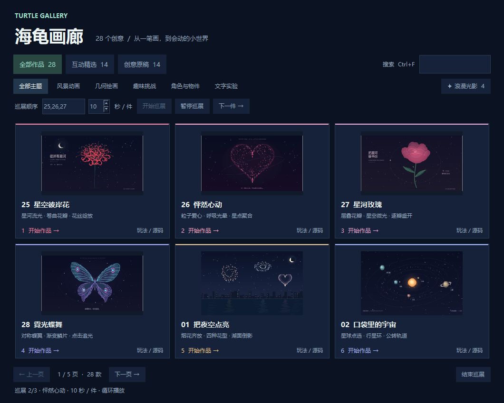
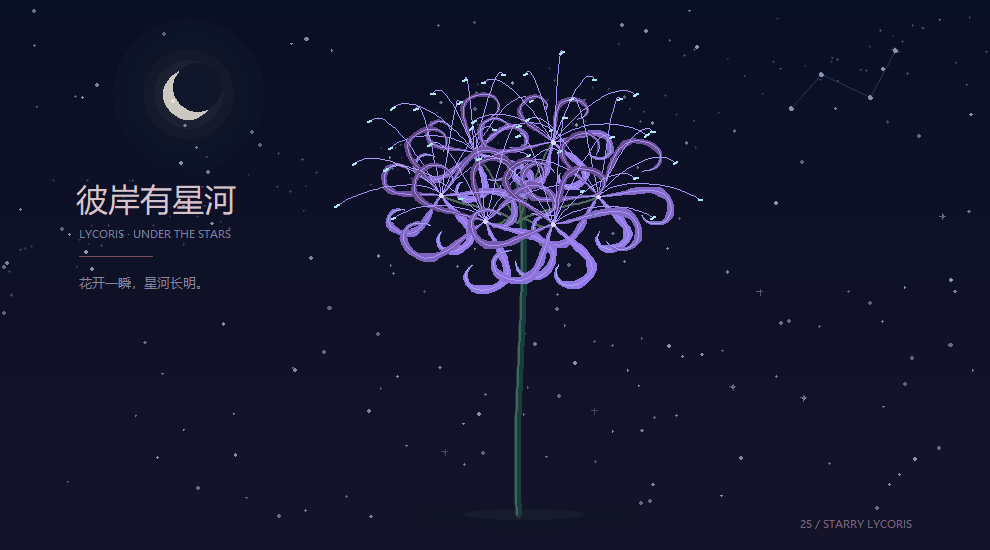

# 让画廊循环展示，把当前画面带走

[返回项目首页](../README.md) · [创作面板与配方](CREATION_GUIDE.md) · [全部互动操作](../社团展示/README.md) · [升级路线](ROADMAP.md)

自动巡展适合活动开场、投影待场和展台循环播放。观众开始操作后，画廊会停留在当前作品；讲解结束再继续巡展。喜欢某一帧时，25、26 的创作面板可以将它保存为 PNG。

| 能力 | 当前可用作品 | 依赖与范围 |
| --- | --- | --- |
| 自动巡展 | 25 星空彼岸花、26 怦然心动、27 星河玫瑰 | Python 标准库与 Tk 桌面环境 |
| JSON 配方 | 25 星空彼岸花、26 怦然心动 | Python 标准库；保存参数与初始构图 |
| 当前画面 PNG | 25 星空彼岸花、26 怦然心动 | 首批支持 Windows，另装 Pillow 11.2.1 或更新版本 |

## 开始一轮巡展

运行 `python run.py` 打开桌面画廊，在分类下方的巡展栏填写作品顺序与单件停留秒数，再点击“开始巡展”。顺序用英文逗号分隔，例如 `25,26,27`；可以调整顺序或只选其中几件，每件编号填写一次。停留时间为 **10–600 秒的整数，默认 30 秒**。

也可以在项目根目录直接启动：

```bash
python run.py --tour 25,26,27 --seconds 30
```

最后一件结束计时后回到第一件，持续循环。当前仅接受上述三件已登记自动演示能力的作品；其他编号、重复编号或无效停留时间会提示错误。`--seconds` 与 `--tour` 一起使用，省略时每件停留 30 秒。



## 观众接管与继续

作品窗口底部的巡展条显示当前位置、倒计时或接管状态，并提供控制入口。作品窗口获得焦点后可用快捷键；桌面画廊也有暂停 / 继续、下一件和结束巡展按钮。

| 操作 | 结果 |
| --- | --- |
| 等待当前倒计时结束 | 自动切换下一件，最后一件后循环 |
| 点击作品、操作创作面板或使用普通作品按键 | 执行原有操作，同时暂停自动切换，停留供观众互动 |
| 只移动鼠标或悬停 | 不打断巡展 |
| P / 巡展条的暂停或继续按钮 | 暂停或继续自动切换；继续时重新给予当前作品完整停留时间 |
| PgDn / 下一件 | 切到下一件作品 |
| 空格 | 暂停 / 继续作品动画，同时作为普通操作暂停自动切换 |
| 作品窗口中 Esc / 关闭当前作品 / 结束巡展 | 结束整轮巡展 |
| 关闭桌面画廊 | 结束巡展并清理当前作品子进程 |

**巡展暂停控制切换，空格控制动画。** 接管后作品通常继续播放，便于点击、调色或打开创作面板。若先前用空格暂停了动画，先按空格恢复动画，再按 P 继续巡展。P 不会替你恢复被空格暂停的动画。输入框获得焦点时，先完成输入并回到作品窗口，再使用巡展快捷键。

例如每件设置 30 秒，在第 20 秒接管当前作品，讲解后按 P，它会再展示完整 30 秒。要立即换场，按 PgDn。

巡展中若作品启动失败或异常退出，会停止巡展并提示原因。正常关闭当前作品也会结束巡展；重新开始可回到画廊设置。现场使用前，建议在展示电脑上走一遍播放、接管、继续和退出流程。

## 把当前画面保存为 PNG

在项目根目录安装可选依赖：

```bash
python -m pip install -r requirements-export.txt
```

这会安装 **Pillow 11.2.1 或更新版本**。正常运行作品、保存配方和巡展都不需要此依赖。当前导出入口支持 Windows；缺少依赖或平台暂不支持时，面板会显示原因。Pillow 从 11.2.1 起提供 Windows 单窗口捕获参数，见 [Pillow ImageGrab 官方文档](https://pillow.readthedocs.io/en/stable/reference/ImageGrab.html)。

1. 打开 **25 星空彼岸花** 或 **26 怦然心动**，调整参数并等待喜欢的画面。也可用空格停在想保存的位置。
2. 按 **E** 或点击作品右上角 **创作面板**，在面板中点击 **导出当前画面 PNG…**。
3. 程序先取得并固定当前帧，再打开保存对话框。选路径所花的时间不会改变待保存的内容。
4. 默认位置为项目根目录的 `exports/`，可自行选择其他目录与文件名。完成后面板显示 **实际宽 × 高像素**和完整保存路径。

`exports/` 已被 Git 忽略，本地保存不会进入仓库提交。要交给同学、放进讲解幻灯片或分享活动记录，发送选中的 PNG 即可；希望别人继续调参时，另存一份 JSON 配方。

## PNG 保存什么

PNG 保存**当前作品绘图区**，保留作品题字，去除系统窗口边框、Canvas 边框、舞台工具说明和巡展控制条。覆盖在作品上方的创作面板也不进入图片。



按当前窗口绘图区像素保存，**以完成提示的实际尺寸为准**。窗口尺寸、Tk 客户区和边框会影响结果，不能把窗口标称尺寸直接当作图片尺寸。PNG 适合当前画面的分享和展示记录；尚未提供矢量导出、指定 16:9 / 9:16 / 1:1 构图、按目标大尺寸重新绘制或短片导出。这些项目继续保留在 [M2 路线图](ROADMAP.md#m2现场展示与带走作品--进行中巡展与当前画面-png)。

保持作品窗口展开并留出足够绘图区；窗口缩得过小或最小化时可能提示导出失败。恢复窗口后重试。保存失败时面板会显示原因；取消保存后仍保留当前创作设置。

PNG 固定一帧的像素，JSON 配方保存参数和种子。配方载入后从头播放，不包含这帧的动画进度或点击过程；PNG 也不能作为配方载入。

## 已实测范围

本轮 Windows 巡展记录覆盖约 355 秒、34 次作品启动，包含三件作品的自动循环、键盘接管、继续与手动切换。另已检查最小窗口、隐藏说明后的巡展按钮、面板快捷键，以及关闭后的清理。长时测试中途被中断，**完整十分钟连续验收仍待完成**，没有把分段运行累加为已通过；记录见 [exhibition-m2.json](benchmarks/exhibition-m2.json)。

在 Windows、Python 3.12.4、Tk 8.6.14 上，两款作品的 1000 × 720 窗口导出为 990 × 550，760 × 580 窗口导出为 750 × 417；这些是本机结果，实际以面板提示为准。面板遮挡前后的导出像素一致，取消保存、元数据写入和暂停状态保留也已检查。混合 DPI 多显示器、远程桌面与锁屏环境尚未实测；macOS / Linux 暂不开放 PNG 导出入口能力。
