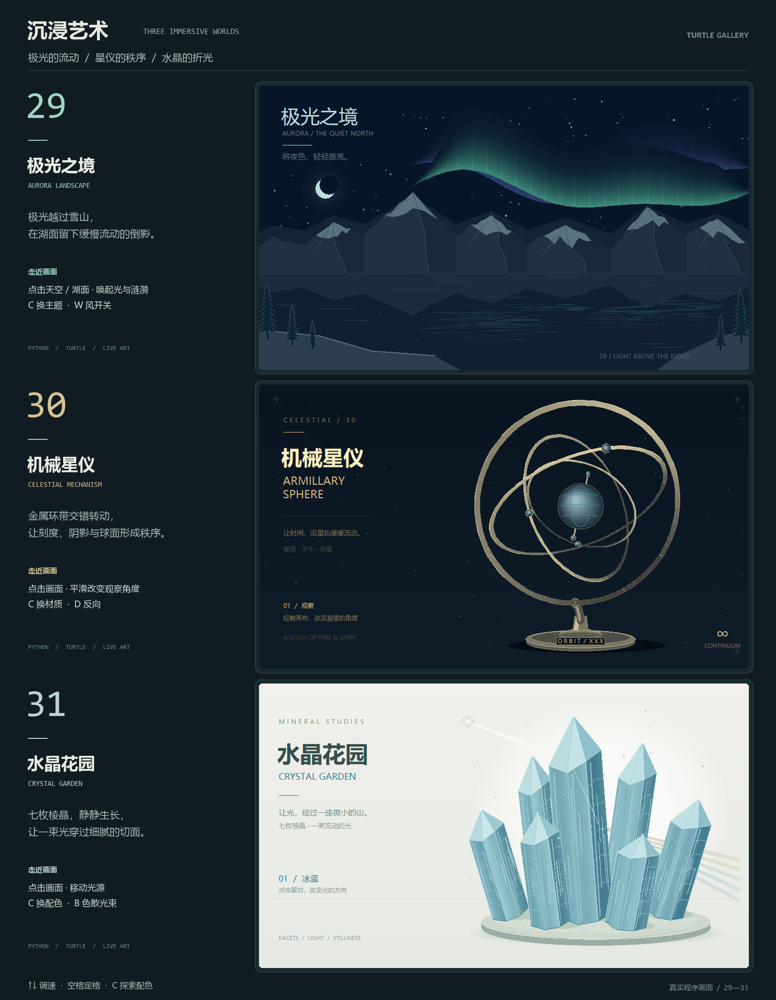
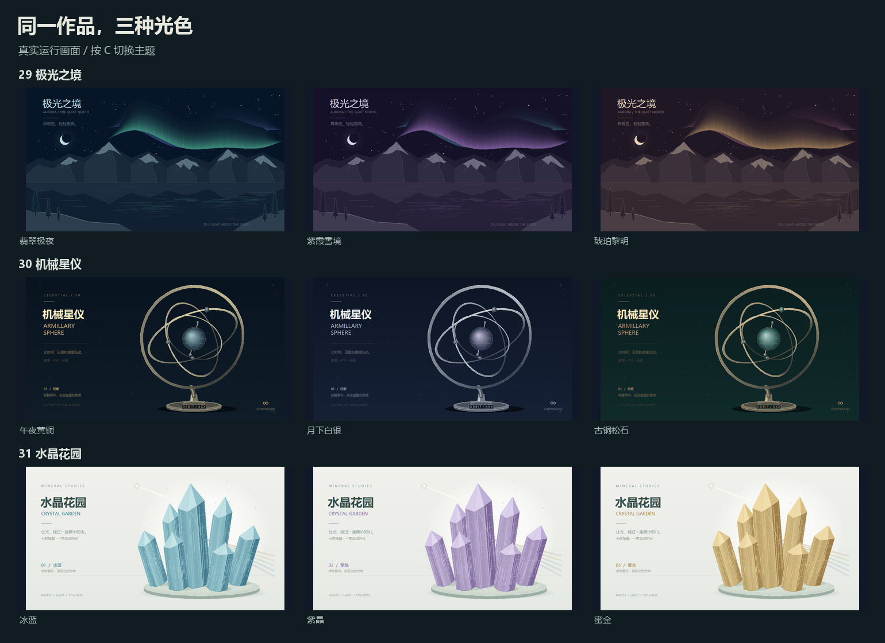
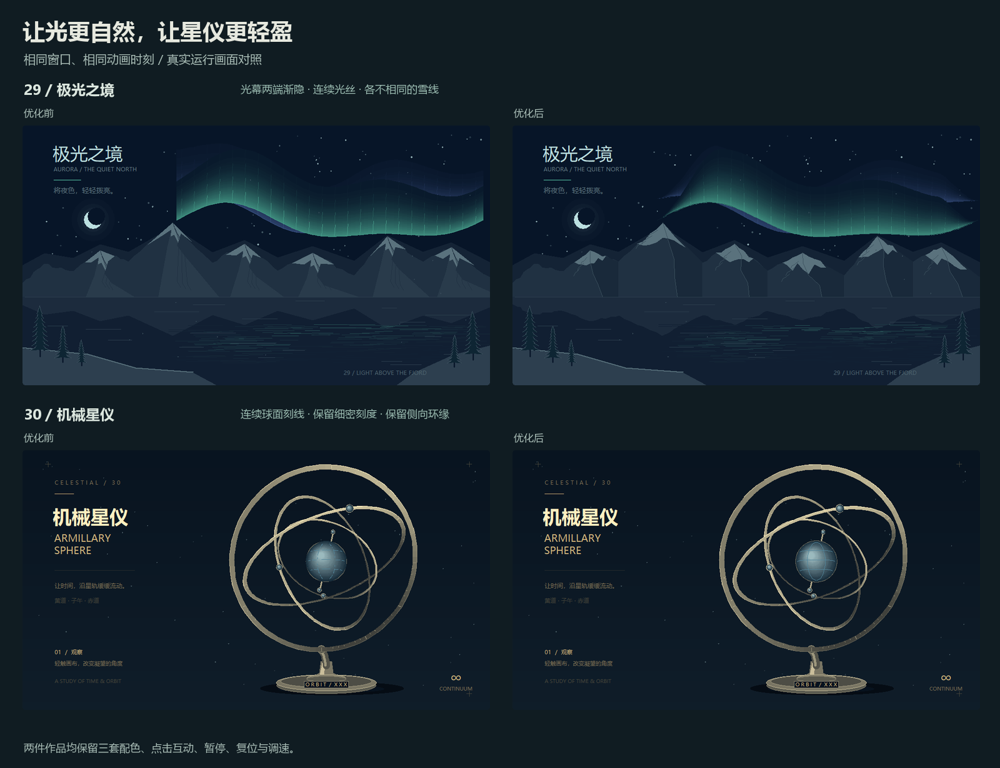

# 沉浸艺术 · 极光、星仪与水晶

[返回画廊](../README.md) · [完整操作表](../社团展示/README.md) · [创作指南](CREATIVE_GUIDE.md)

29～31 是三件桌面互动展品：从雪山湖面的夜色，到转动的金属环带，再到浅色展台上的晶簇。图形由 Python 标准库实时绘制，共用 `Stage` / `Paint` 的窗口、缩放与通用操作。



## 运行与操作

在项目根目录运行：

```bash
python run.py --demo 29
python run.py --demo 30
python run.py --demo 31
```

也可运行 `python run.py`，搜索“沉浸艺术”或作品名称。保留完整项目中的 `社团展示/` 目录。运行作品无需第三方库；Tkinter 需要桌面显示环境。

| 作品 | 专属操作 | 速度范围 |
| --- | --- | --- |
| 29 极光之境 | C 换主题；W 开关风；点击天空唤起光涌，点击下方湖面泛起波纹 | ↑↓，0.25～2 倍 |
| 30 机械星仪 | C 换材质配色；D 反向；点击画布平滑改变观察角度 | ↑↓，0.25～2.5 倍 |
| 31 水晶花园 | C 换晶体配色；B 显示/隐藏彩色光束；点击移动光源 | ↑↓，光线运动 0.25～2.5 倍 |

共用 **空格 暂停/继续、R 重来、H 隐藏/显示说明、F11 全屏、Esc 退出**。先让作品窗口获得键盘焦点。暂停后画面定格，专属操作暂不改变画面；先按空格继续再操作。29、31 的 R 恢复默认主题与互动状态；30 的 R 保留当前材质，复位速度、方向和观察角度。

三件新作在电脑桌面运行，网页画廊展示预览与源码。当前浏览器试玩仍为 01 烟花、03 万花筒、26 粒子爱心；配方和自动巡展的适用作品见[创作指南](CREATION_GUIDE.md)与[展示指南](EXHIBITION_GUIDE.md)。

## 29 · 极光之境

[打开源码](../社团展示/29_极光之境.py)

两层流动的极光帘幕铺在雪山后方，细密光纹形成明暗变化；山脊、松林与前景湖岸组成远近层次，下方水面以细碎横纹映出光带。C 在“翡翠极夜”“紫霞雪境”“琥珀黎明”之间切换，整幅夜色随之变化。

点击天空会让附近极光抬升、发亮，再慢慢回落；点击下方湖面会留下渐渐扩散的椭圆波纹。W 可以比较有风的飘雪与安静的夜景，↑↓ 改变极光的流动速度。现场展示时先让观众看完整构图，再依次点击天空和湖面，容易看出同一种输入如何在不同区域产生不同回应。

可以从 `THEMES` 修改夜空和光带的颜色，再看 `curtain()` 怎样用曲线叠出幕帘，`draw_curtains()` 怎样分层绘制，`touch()` 怎样区分两处交互。极光与水纹采用艺术化曲线，颜色和运动用于营造风景氛围。

## 30 · 机械星仪

[打开源码](../社团展示/30_机械星仪.py)

四道金属环带围绕球体缓慢转动，外缘刻度、亮暗边线、球面高光和底座共同形成桌上仪器的质感。环带按空间深度绘制，转动时可以看到前后遮挡交替。C 依次切换“午夜黄铜”“月下白银”“古铜松石”。

点击画布改变左右与俯仰观察角度，视角会平滑靠近目标；D 改变旋转方向，↑↓ 控制速度。暂停在环带交叉的位置，适合讲解三维坐标如何投影为二维画面，以及绘制顺序如何表现遮挡。

修改 `RINGS` 可以比较环带半径、宽度与刻度密度；`bases()` 决定环带方向，`project()` 完成透视投影，`geometry()` 组合环面、刻度与球体。它是一件艺术化机械装置，环带运动并不对应真实天体轨道或测量功能。

## 31 · 水晶花园

[打开源码](../社团展示/31_水晶花园.py)

七枚不同高低的晶体立在浅色展台上，棱边、切面、内部细纹与柔和投影让每枚晶体保持清晰轮廓。背景保留留白，彩色光束从晶簇附近散开。C 在“冰蓝”“紫晶”“蜜金”三套配色之间切换。

点击画面移动光源，切面明暗会随光的方向改变；光源在目标附近轻轻游动，↑↓ 控制这一运动的速度。B 可以收起彩色光束，观察单纯切面明暗与加入彩光时的不同。可先点击左上方，再点击右侧，对比同一片晶面的颜色变化。

`build_geometry()` 建立七枚晶体的切面与固定纹理，`illuminate()` 接收点击位置，`light_position()` 计算光源位置，`draw_crystal()` 根据光源调整切面明暗。彩色光束是色散的艺术表现，未计算真实折射路径或材料光学参数。

## 三分钟展示

| 时间 | 作品 | 展示动作 |
| --- | --- | --- |
| 第一分钟 | 极光之境 | 点击天空与水面，C 比较夜色，W 比较风的效果 |
| 第二分钟 | 机械星仪 | 点击改变视角，D 反向，暂停观察环带遮挡 |
| 第三分钟 | 水晶花园 | 点击移动光源，B 比较有无光束，C 切换晶体材质配色 |

需要安静展示时按 H 收起说明、F11 全屏；需要解释画面时按空格定格。三件作品的主题、点击结果和速度都可以在各自窗口中直接体验。

## 九种光色



## 2026-10-10 · 光幕与星仪精修



极光的两端平滑收尖，连续光丝沿幕帘伸展，六座雪峰各有不同雪线与背光坡，山体倒影跟随细碎的山脊。光幕左侧的硬截断和光丝错位已消除。

星仪用原生椭圆绘制球面渐变，五条连续曲线绘制经纬线；保留 216 条刻度与侧向环缘。`DepthPaint.finish_depth()` 让每个部件保留自己的 Canvas 对象，只调整必要的前后顺序，静止球体不再因环带排序反复更新坐标。环带采样的投影弦偏差在检查的视角内小于 0.3 个逻辑像素。

### 同条件测量

用 [check_immersive.py](../tools/check_immersive.py) 对比首版提交 `d674b98` 与本轮源码，同一 Windows 环境、同一窗口尺寸、同一输入序列，每组采样 120 帧。两版依次运行，不同时打开绘图窗口。

| 作品 / 窗口 | 优化前中位 / P95 | 优化后中位 / P95 | Canvas 对象数 |
| --- | --- | --- | --- |
| 极光 · 1000 × 720 | 32.70 / 34.93 ms | 40.40 / 42.68 ms | 925 → 1049 |
| 极光 · 760 × 580 | 32.36 / 35.24 ms | 38.54 / 41.25 ms | 925 → 1049 |
| 星仪 · 1000 × 720 | 32.21 / 35.32 ms | 21.42 / 23.67 ms | 1267 → 964 |
| 星仪 · 760 × 580 | 31.58 / 34.77 ms | 21.42 / 23.45 ms | 1267 → 964 |

星仪在 1000 × 720 窗口的绘制与 Tk 更新总耗时中位数下降约 33.5%；单独的几何与 Canvas 指令提交耗时由 13.93 降至 7.51 ms。极光增加渐隐和雪山细节的代价是约 6.2～7.7 ms 的额外绘制时间。

这些数据不含动画定时器等待，也不是播放帧率保证。两版三主题、大小窗口、点击、暂停像素不变、R 恢复初始画面及对象池稳定均通过检查。[完整报告与源码哈希 →](benchmarks/immersive-refinement.json)

## 首版运行记录（2026-10-09）

2026-10-09 在 Windows / Python 3.12.4 / Tk 8.6 下检查了 1000 × 720 与 760 × 580 窗口。每件作品均实际运行三套配色、点击交互、暂停与重置；暂停后连续五帧的画面像素保持一致。连续绘制 120 帧，Canvas 对象池没有增长。

| 作品 | 1000 × 720 中位耗时 / P95 | Canvas 对象数 |
| --- | --- | --- |
| 极光之境 | 33.55 / 37.94 ms | 925 |
| 机械星仪 | 112.88 / 129.02 ms | 1267 |
| 水晶花园 | 16.68 / 22.34 ms | 716 |

这里测量单次 `frame(.025)` 加 Tk 更新，未计入动画定时器等待；数据仅代表这台电脑上的本次运行，不是最终播放帧率。小窗口与完整记录见[实测数据](benchmarks/immersive-art.json)。极光通过连续渐变幕帘与较少光纹控制绘制量，水晶几何和星仪单位圆预先建立，避免每帧重新随机生成。

星仪在此次桌面测量中有明显波动，另一次同窗口复测为中位 40.99 ms、P95 122.72 ms；环缘修复前的对照为 43.32 / 125.42 ms。当前数据未显示这次修复导致变慢，但也不能证明稳定流畅，星仪的绘制性能仍有优化空间。

## 复现与维护

可运行 `python -m unittest discover -s tests -p test_immersive_art.py -v` 检查暂停、缩放点击、对象池、视角投影、光源跟随、静止球体复用与深度排序。媒体维护另需 Pillow 与 Windows 桌面环境，详见[贡献指南](CONTRIBUTING.md#更新展示图片)：

```bash
python tools/render_media.py --immersive --compose-hero
python tools/render_media.py --compose-immersive
python tools/check_immersive.py --baseline-ref d674b98 --samples 120
python tools/render_media.py --compose-immersive-palettes .work/immersive-check/current
```

第一条重新捕获三件作品并更新专题总览与首页计数；第二条仅用已有截图重排专题总览。

后两条依次检查两版场景，保存配色、交互、小窗口截图和 JSON 报告，再用本轮截图重建九色总览。可用 `--works 29 30` 只检查指定作品；历史对照仅替换作品源码，共用舞台与捕获工具保持当前版本，不是对整个旧版本环境的复现。仅从可信的本地提交读取对照代码。
