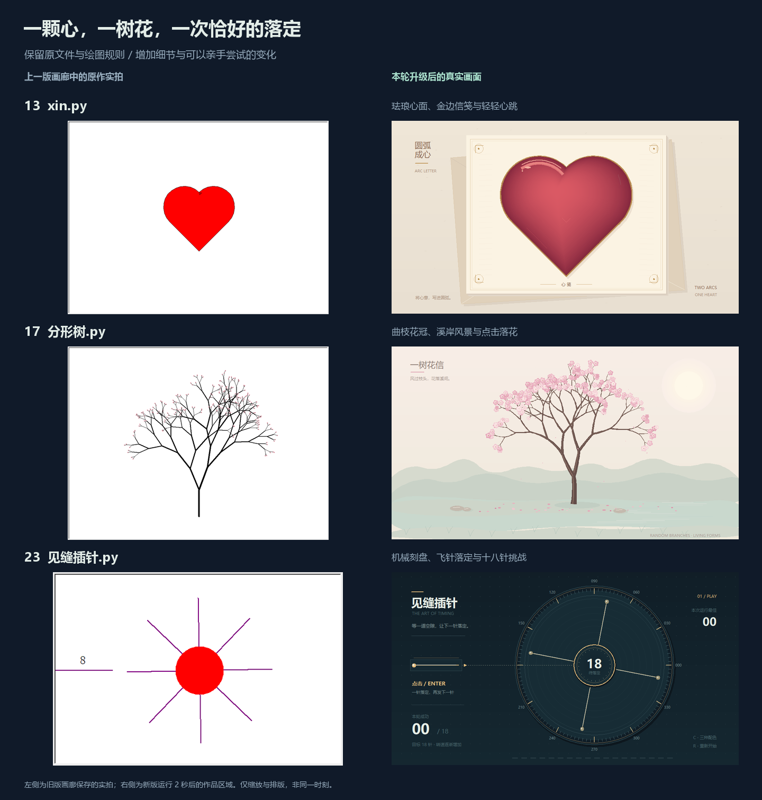
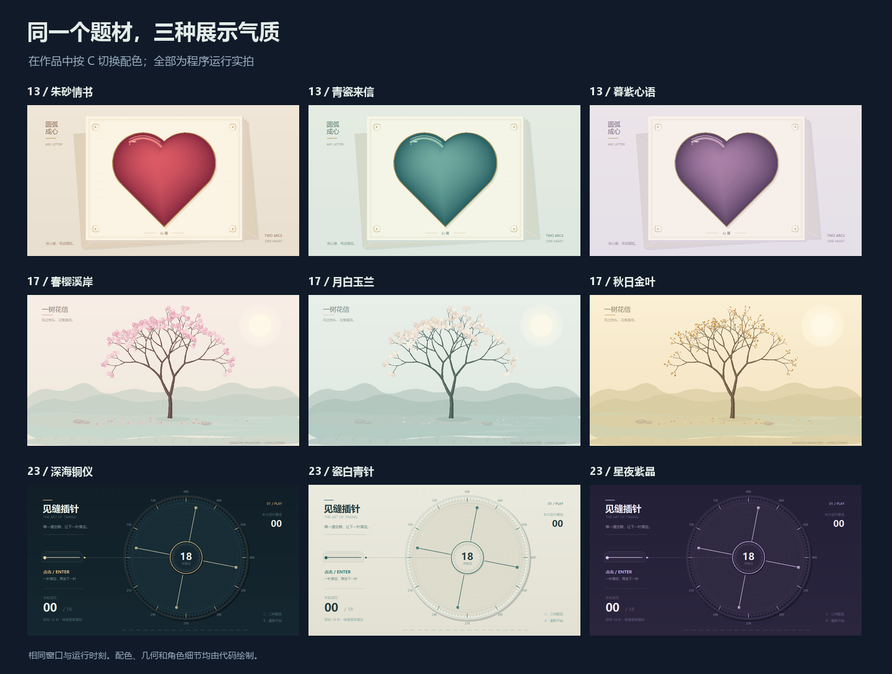

# 原文件继续焕新：红心、花树与插针

[返回画廊](../README.md) · [上一轮：圆阵、螺旋与头像](ORIGINAL_STUDIES.md) · [全部原作操作](CREATIVE_GUIDE.md#14-个创意原作)

本轮直接升级根目录的 **`xin.py`、`分形树.py`、`见缝插针.py`**。保留圆弧爱心、随机分叉与旋转插针的原有主题，加入更细致的材质、完整构图与可讲解的交互。文件名、编号和“创意原稿”分类继续保留；目前十二份原作接入共用舞台，画廊仍为 **14 款互动展品 + 14 个创意原作，共 28 款**。



左侧为上一版画廊保存的原作截图，右侧为本轮程序的真实运行截图。画面仅作作品区域裁切、缩放与排版；前后图不代表同一时刻。

## 直接运行原文件

在项目根目录任选一条运行：

```bash
python xin.py
python 分形树.py
python 见缝插针.py
```

也可使用 `python run.py --demo 13`、`--demo 17` 或 `--demo 23`，或从桌面画廊选择作品。需要 **Python 3.9+、Tkinter 和桌面显示环境**。作品只使用标准库，图形由代码绘制；复制时请保留完整项目及 `社团展示/` 共用模块。导入这三份文件不会自动打开窗口。

## 看点与操作

| 原文件 | 本轮变化 | 专属操作 |
| --- | --- | --- |
| [13 一颗红心 · xin.py](../xin.py) | 纸笺、信封、金属描边与珐琅心面，保留两段半圆和两条直线 | C 配色；G 重描圆弧；↑↓ 心跳速度；点击心面点亮微光 |
| [17 随机分形树 · 分形树.py](../分形树.py) | 曲线渐细枝干、溪岸远山和三种花冠，相同种子生成相同几何 | C 配色；N 换一棵树；G 逐层生长；点击吹落花瓣 |
| [23 见缝插针 · 见缝插针.py](../见缝插针.py) | 机械转盘、刻线、飞行过程、成功进度与结束反馈 | 点击画面或 Enter 发针；C 配色；R 重新挑战 |

三款通用：**空格暂停/继续 · R 重来 · H 隐藏说明 · F11 全屏 · Esc 退出**。键盘操作需要作品窗口获得焦点；暂停时点击、重描、生长、换树与发针不启动，C 仍可换色。

红心与花树的 R 恢复初始配色和状态，花树回到默认种子 **202610**。插针的 R 开始新一局，保留当前配色和**本次窗口**的最高成绩；关闭作品后最高成绩不会保存。

### 红心：先展示，再看圆弧如何闭合

默认先呈现完整心面，细小的双拍缩放形成心跳。按 G 用 **4.2 秒**重描轮廓，结束后恢复完整心面；↑↓ 调整 **0.25～2 倍**心跳速度，不改变重描时长。完整心面才接受点击，心外和两瓣顶部之间的留白不会触发。

点击后的一组微光持续 **2.4 秒**；连续点击重新开始这一组，最多十二枚，不不断追加对象。适合先按 G 讲两段半圆与两条直线的关系，再让观众点击观察高光。

### 花树：换颜色，也能重现同一棵树

默认呈现完整花冠，按 G 观察枝干逐层伸出，再开花。按 N 生成下一棵树，窗口说明栏显示当前种子；N 使用确定的种子序列，R 后再次按 N 可回到同一序列。C 仅切换配色与花叶画法，枝条几何保持不变。

点击场景后，靠近点击位置的已开放花朵吹出短阵花瓣；生长尚未到达花冠时，不凭空生成花瓣。每次至多加入十六片，互动花瓣总数最多四十八片，并在 **4.2 秒**后消退。背景另有十二片轻缓飘落的花瓣。

### 插针：看准抵达时刻

圆盘开始时已有 **4 针**，它们不计入成绩。点击或按 Enter 发出一针，需要 **0.28 秒**抵达；飞行期间不能再发第二针，圆盘继续旋转。抵达时与已有针的最短圆周角距离**小于 8°**即碰撞，恰好 8°仍可落定。

每成功落定一针记一分，转速逐渐增加；累计 **18 针**成功即通关。碰撞或通关后圆盘停止，画面显示结果；按 R 直接重新挑战。本次窗口最高成绩保留，适合社团轮流挑战。暂停冻结转盘和正在飞行的针。



| 作品 | 三套配色 |
| --- | --- |
| 一颗红心 | 朱砂情书 · 青瓷来信 · 暮紫心语 |
| 随机分形树 | 春樱溪岸 · 月白玉兰 · 秋日金叶 |
| 见缝插针 | 深海铜仪 · 瓷白青针 · 星夜紫晶 |

## 从画面讲到代码

### 红心：沿原有圆弧等速描线

`heart_point(progress)` 保留两段半圆和两条直线。圆弧半径为 `r`，每条直线长 `2r`，总周长为 `r(2π+4)`；函数按走过的长度分配进度，让笔尖经过圆弧和直线时保持一致的描线速度。`inside_heart()` 使用解析几何判断点击是否位于心面内，随心跳缩放时先将点击坐标还原到心形局部坐标。

`PALETTES` 管理纸面、心面、金属和反光颜色；`enamel()` 用向左上方偏移、逐渐缩小的轮廓形成暗边与高光。`paper()` 缓存信纸和信封，只在配色或窗口变化时重画。`pose()` 按经过时间计算心跳，`effects()` 维护有限微光；修改 `TRACE_SECONDS` 与 `BURST_SECONDS` 可分别比较描线和点击反馈的节奏。

### 花树：保留随机递归，让种子可复现

`generate_tree(seed)` 使用独立的随机数生成器。每次左右分叉仍在 **10～40°**中选角度，每级枝长仍减少 **10～20**；枝条由曲线采样得到，`branch_outline()` 沿曲线构造逐渐收细的轮廓。所有枝条与花朵统一缩放到作品区域，子枝起点保持连接在父枝终点。

深度最多 7、枝条最多 255 段、花朵最多 220 朵，防止递归和长期互动增加绘图负担。换色不会重新生成几何。`draw_tree()` 缓存成熟树，生长期间才按进度更新；普通帧只更新少量花瓣。可以先改 `PALETTES`，再用固定种子比较角度、减长和曲枝宽度的影响。

### 插针：先推进到抵达时刻，再判定碰撞

`angular_distance(a, b)` 计算最短圆周角距离，正确处理跨越 0° / 360° 的情况。`fire()` 只负责开始一次飞行；`advance(dt)` 将当前帧推进到针真正抵达的时刻，`arrive()` 将固定入针方向转换为转盘局部角度，再与所有已有针比较。

成功落针后，剩余帧时间按新的转速继续推进。因此改变帧长不会把判定时刻误移到整帧末尾。`FLIGHT_SECONDS`、`CLEARANCE`、`TARGET` 分别控制飞行时间、碰撞间隔和目标针数；`speed` 根据成绩计算转速。静态仪表底图缓存，运动层仅更新已有针、飞针和反馈，结束后等待玩家重开。

## 验证与性能记录

[本轮性能记录](benchmarks/original-bloom-play.json)用于记录实际运行环境、窗口尺寸、采样方法、绘制耗时与 Canvas 对象数。逐帧绘制与 `screen.update()` 的耗时用于观察本机绘制成本，不等同于端到端帧率。

Windows / Python 3.12.4 / Tk 8.6.14，1000 × 720 窗口预运行 50 帧后采样 120 帧：

| 作品 | 绘制耗时中位数 | P95 | Canvas 对象数 |
| --- | --- | --- | --- |
| 一颗红心 | 13.12 ms | 15.99 ms | 258 |
| 随机分形树 | 25.92 ms | 32.24 ms | 1070 |
| 见缝插针 | 11.54 ms | 15.79 ms | 721 |

已检查九套配色、760 × 580 小窗口、爱心重描和心面点击、树的生长与换种子，以及插针飞行、碰撞和通关提示。三份原文件在项目外目录直接运行、经 `run.py` 启动并关闭，共六种入口检查通过。全套 237 项测试中 236 项通过，1 项可选 GUI 字体检查跳过；网页的作品发现、搜索和手机布局三组检查通过。

花树完整花冠的绘制成本高于另外两款。静态树形与背景按需重建，花瓣数量有上限；这里记录的是当前本机实测值，其他电脑、窗口尺寸和生长重播阶段可能不同。

专项测试入口：

```bash
python -m unittest discover -s tests -p test_original_heart.py -v
python -m unittest discover -s tests -p test_original_random_tree.py -v
python -m unittest discover -s tests -p test_original_needles.py -v
```

几何与状态检查不能代替实际观看。更新时应检查九套配色、760 × 580 小窗口、暂停、重置和原文件直接启动；红心检查轮廓闭合和心面点击，花树检查种子切换、生长完成与花瓣消退，插针检查飞行中暂停、连续输入、碰撞、通关及最佳成绩保留。

## 更新画廊预览

在 Windows 桌面环境运行：

```bash
python -m pip install -r requirements-media.txt
python tools/render_media.py --original-ids 13 17 23 --compose-originals
python tools/export_gallery.py
python tools/check_catalog.py
```

媒体工具根据 `作品目录.py` 的 `entry_class` 导入 `ArcHeart`、`BlossomTree`、`NeedleGame`，更新主预览、两种缩略图与原作总览。Pillow 仅供可选媒体维护，作品本身不依赖它。三款仍归入原作集合；创作面板与自动巡展的适用范围见各自指南。
