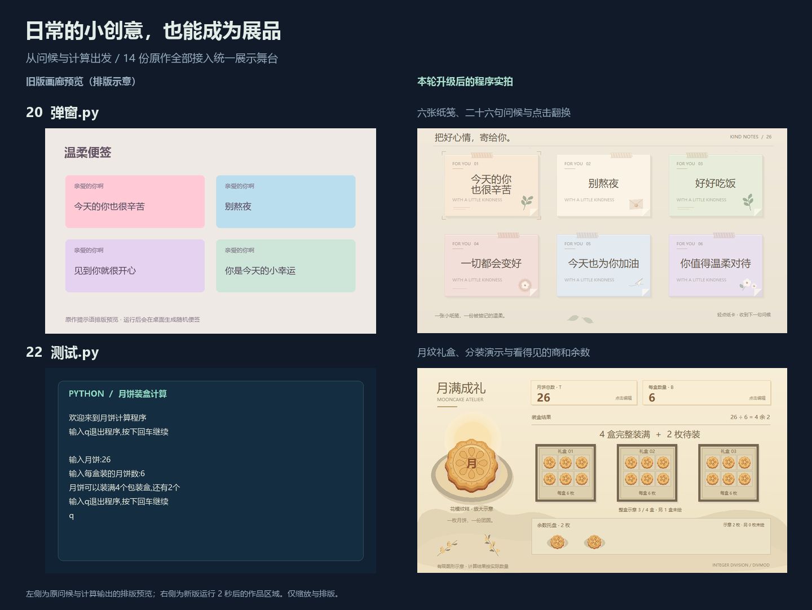
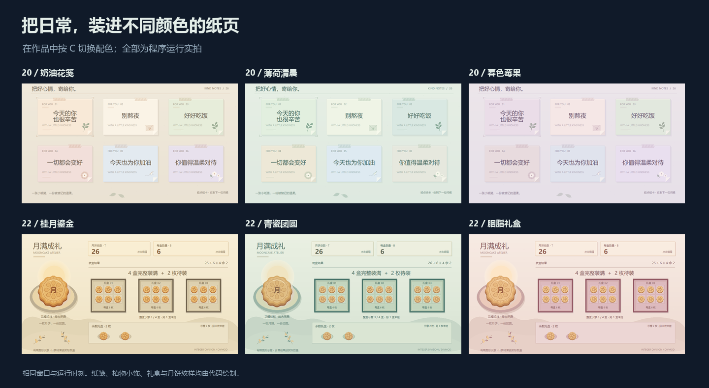

# 原文件继续焕新：便签与月饼

[返回画廊](../README.md) · [上一轮：红心、花树与插针](ORIGINAL_BLOOM_PLAY.md) · [全部原作操作](CREATIVE_GUIDE.md#14-个创意原作)

本轮直接升级根目录的 **`弹窗.py` 与 `测试.py`**：把问候文字放进同一幅纸笺小景，把整除和余数变成可以调节、观察和重播的月饼礼盒。保留原有问候、计算主题、文件名、编号与“创意原稿”分类。至此 **14 份原作全部接入共用舞台**，画廊仍为 **14 款互动展品 + 14 个创意原作，共 28 款**。

更新日期：**2026-10-08**。



左侧保留上一版画廊的预览：便签是原文排版示意，月饼是实际计算输出的排版。右侧为本轮程序真实运行截图，仅裁切作品区域、缩放和排版；当前画廊中十四份原作的预览均已使用实际运行截图。

## 直接运行原文件

在项目根目录任选一条运行：

```bash
python 弹窗.py
python 测试.py
```

也可使用 `python run.py --demo 20`、`python run.py --demo 22`，或从桌面画廊选择作品。两款默认打开图形窗口，需要 **Python 3.9+、Tkinter 和桌面显示环境**。作品只使用标准库，纸笺、礼盒与月饼由代码绘制；复制时保留完整项目及 `社团展示/` 共用模块。导入文件不会自动打开窗口或等待文字输入。

月饼保留终端问答入口：

```bash
python 测试.py --console
```

在终端按回车开始，依次填写总数与每盒数量；在任一提示处输入 q 结束，关闭输入流（EOF）也可退出。图形与终端入口使用相同范围：总数 **0～999999**、每盒容量 **1～99**，只接受十进制整数。终端遇到非整数或超出范围的输入会提示重新填写。

## 看点与操作

| 原文件 | 本轮变化 | 专属操作 |
| --- | --- | --- |
| [20 温柔便签 · 弹窗.py](../弹窗.py) | 六张纸笺、纸面层次和桌面装饰，保留原有 26 句问候 | C 配色；N 换组；←→ 选卡；点击或 Enter 翻换问候 |
| [22 月饼计算 · 测试.py](../测试.py) | 图形礼盒、月饼纹样与装盒过程，同时显示整盒与余数 | C 配色；N 示例；G 重播；↑↓ 总数；←→ 每盒容量；T / B 输入总数 / 容量 |

两款图形模式通用：**空格暂停/继续 · R 重来 · H 隐藏说明 · F11 全屏 · Esc 退出**。键盘操作需要作品窗口获得焦点。关闭作品窗口即可结束，也可从画廊点击“结束作品”。

### 便签：把问候放在一张桌面上

六张卡片始终呈现在同一窗口，点击某张卡片翻换它的问候，或先用 ←→ 选择，再按 Enter。纸卡在 **0.64 秒**内轻轻抬起并落回，文字在途中更新；动画中的同一张卡不会叠加翻换。N 更换整组文字，需等待当前翻换完成；C 切换纸面与装饰配色。适合请社团成员依次选一张卡片，再打开源码写入自己的问候。

卡片数量保持为六张，反复点击或换组也不会持续增加窗口和绘图对象。修改文字后应检查最长的一句在普通窗口与小窗口中都能完整显示。

### 月饼：让整除和余数看得见

默认示例为 **26 枚月饼，每盒 6 枚**，得到 **4 整盒、剩余 2 枚**。↑↓ 每次调整总数 1 枚，←→ 每次调整容量 1 枚；需要指定数值时，按 T 输入总数、B 输入容量，也可点击上方对应数字。取消输入或提交无效值都会保留原数，无效值会在说明栏提示。N 切换零值、整除、带余数与大数等示例；G 用 **4.2 秒**逐个显示示意月饼，适合先猜结果，再观察画面。

总数范围为 **0～999999**，每盒容量为 **1～99**。画面最多绘制 **3 个整盒，每盒最多 6 枚样品；余数托盘最多绘制 6 枚**。盒数、每盒实际容量、余数与未绘数量均明确标注，默认示例也会说明另有 1 整盒未绘。左侧大月饼标为“花模纹样 · 放大示意”，不计入盒内或托盘数量。计算始终使用完整输入，绘图数量保持有界，避免大数输入生成成千上万个图形。

### 三套主题

两款都用 C 依次切换，换色保留当前问候或计算数量。

| 作品 | 默认主题 | 第二套 | 第三套 |
| --- | --- | --- | --- |
| 温柔便签 | 奶油花笺：暖纸与柔和花叶 | 薄荷清晨：浅绿纸面与植物色 | 暮色莓果：淡紫纸面与莓果色 |
| 月饼装盒 | 桂月鎏金：暖金饼面与素色礼盒 | 青瓷团圆：青绿礼盒与浅色衬纸 | 胭脂礼盒：胭脂盒面与暖色饼纹 |



## 从画面讲到代码

便签可以从问候列表和配色开始改：观察文字内容与卡片布局如何分开，鼠标点击与键盘如何使用同一份选卡状态。控制纸笺数量，让长时间换组始终使用固定规模的画面。

月饼可以从整数除法开始：`整盒数, 余数 = divmod(总数, 每盒容量)`。先计算完整结果，再决定展示多少礼盒与月饼；图示的数量上限不会改变计算结果。图形入口与终端入口共享计算规则，修改范围或校验时应同时检查两种入口。

| 文件 / 场景类 | 修改入口 | 可以观察什么 |
| --- | --- | --- |
| [弹窗.py · KindNotes](../弹窗.py) | `MESSAGES`、`PALETTES`、`note_lines()` | 原有 26 句问候、三套纸色与中文换行 |
| 同上 | `change_selected()`、`next_group()`、`card_lift()`、`draw_card()` | 单张与整组换句、选卡状态、抬升动画及纸面装饰 |
| [测试.py · MooncakePacking](../测试.py) | `packing()`、`parse_number()`、`console_main()` | 有范围的整数计算、图形与终端共用校验、终端退出和错误重输 |
| 同上 | `EXAMPLES`、`PALETTES`、`cake()`、`draw_box()`、`draw()` | 示例、礼盒主题、花模纹样，以及完整结果与部分图示的关系 |

便签的时长由 `TURN_SECONDS` 控制。月饼的 `DEMO_SECONDS` 控制重播时长，`BOX_LIMIT` 与 `SAMPLE_LIMIT` 控制图示上限；调整上限时也要检查画面布局和数量说明。两款暂停时都停止动画及内容互动，C 仍可预览配色；R 恢复默认配色与初始内容。

## 验证与性能记录

[本轮性能记录](benchmarks/original-everyday.json)记录运行环境、窗口尺寸、采样方法、绘制耗时与 Canvas 对象数。逐帧绘制加 `screen.update()` 的耗时用于观察本机绘制成本，不等同于端到端帧率。

Windows / Python 3.12.4 / Tk 8.6.14，1000 × 720 窗口预运行 50 帧后，在默认完整画面采样 120 帧：

| 作品 | 绘制耗时中位数 | P95 | Canvas 对象数 |
| --- | --- | --- | --- |
| 温柔便签 | 6.02 ms | 9.02 ms | 303 |
| 月饼装盒计算 | 13.19 ms | 15.97 ms | 576 |

这组数据对应静止后的默认画面，换组、装盒重播与不同电脑的耗时可能不同。静态画面使用缓存；便签维持六张卡，月饼按显示上限生成图形，大数不会增加到同等数量的 Canvas 对象。

本轮已实拍六套配色、760 × 580 小窗口、便签最长文字、月饼空值和最大数量。两份原文件从项目外目录直接运行、经 `run.py` 启动并关闭，共四种入口检查通过。真实输入框的确定、取消、无效输入、恢复键盘与输入期间关闭主窗口均已检查；关闭父窗口后不再向已销毁的窗口恢复焦点。

全套 **254 项测试中 253 项通过，1 项可选 GUI 字体检查跳过**。网页的作品发现、搜索和手机布局三组检查通过。

维护时需要实际检查六套配色、760 × 580 小窗口、暂停与恢复、重置、原文件直接运行和从画廊启动。便签检查每张卡片的点击范围、←→ 与 Enter、换组和最长文字；月饼检查 0、整除、存在余数、最大范围、输入取消和无效值保留原数、重播和大数示意，同时单独检查终端的错误重输、q 与 EOF 退出。

## 更新画廊预览

在 Windows 桌面环境运行：

```bash
python -m pip install -r requirements-media.txt
python tools/render_media.py --original-ids 20 22 --compose-originals
python tools/export_gallery.py
python tools/check_catalog.py
```

媒体工具根据 `作品目录.py` 的 `entry_class` 导入 `KindNotes` 与 `MooncakePacking`，更新主预览、两种缩略图和原作总览。Pillow 仅供可选媒体维护，作品本身不依赖它。两款继续归入原作集合；创作面板与自动巡展的适用范围见各自指南。
