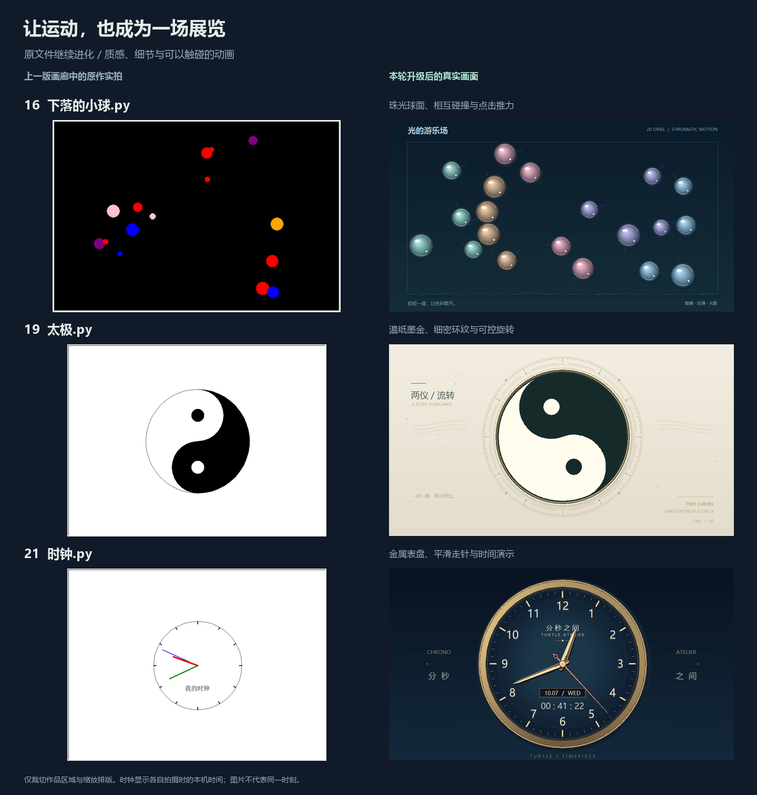
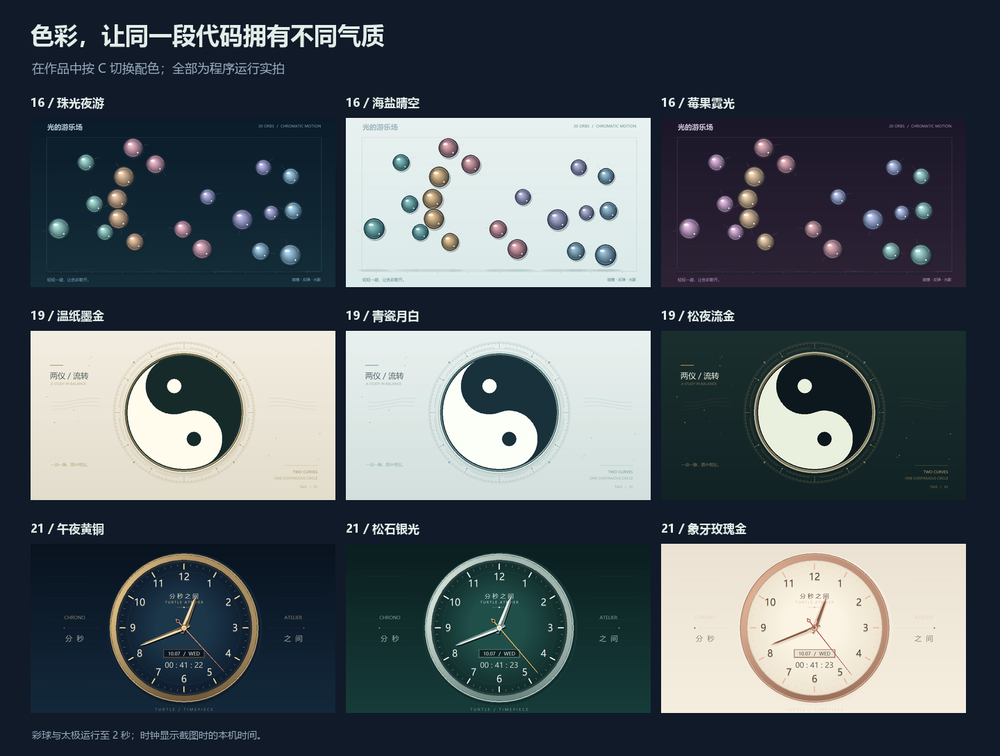

# 原文件继续焕新：彩球、太极与时钟

[返回画廊](../README.md) · [上一轮：叶影、雨伞与风车](ORIGINAL_UPGRADES.md) · [全部原作操作](CREATIVE_GUIDE.md#14-个创意原作)

本轮直接升级根目录的 **`下落的小球.py`、`太极.py`、`时钟.py`**，让原来的运动实验具备更完整的材质、构图与互动。三份文件保留原文件名、编号和题材，仍归入“创意原稿”；画廊保持 **14 款互动展品 + 14 个创意原作，共 28 款**。加上上一轮的叶影、雨伞与风车，已有六份原文件接入共用舞台。



左侧使用升级前画廊保留的原作截图，右侧为本轮实际运行画面；仅裁切作品区域与缩放排版。时钟显示各自拍摄时的本机时间，前后图不代表同一时刻。

## 直接打开原文件

在项目根目录任选一条运行：

```bash
python 下落的小球.py
python 太极.py
python 时钟.py
```

也可运行 `python run.py --demo 16`、`--demo 19` 或 `--demo 21`，或从桌面画廊选择。需要 **Python 3.9+、Tkinter 和桌面显示环境**，仅使用标准库，无需网络和外部图片。三份原文件复用 `社团展示/` 共用模块，复制时请保留完整项目；单独导入文件不会打开窗口。

## 看点与操作

| 原文件 | 本轮变化 | 专属操作 |
| --- | --- | --- |
| [16 彩球碰撞 · 下落的小球.py](../下落的小球.py) | 20 颗珠光彩球加入渐变球面、弧形高光、地面投影与短尾迹，在展台内运动、碰撞和反弹 | C 配色；G 重力开关；↑↓ 调至 0.25～2 倍速度；点击展台推开附近彩球 |
| [19 旋转太极 · 太极.py](../太极.py) | 以圆弧构造黑白双鱼，搭配纸底纤维、金属边缘、细密环纹与侧边微光 | C 配色；↑↓ 调至 0～3 倍速度；D 反向；L 显示/隐藏环纹；点击泛起涟漪 |
| [21 指针时钟 · 时钟.py](../时钟.py) | 金属拉丝表圈、立体指针、分钟刻度、日期窗与数字读数，默认显示本机真实时间 | C 配色；T 平滑/跳秒；D 真实/演示；↑↓ 调演示速度；点击表盘显示/隐藏数字读数 |

三款通用：**空格暂停/继续 · R 恢复初始状态 · H 隐藏说明 · F11 全屏 · Esc 退出**。键盘操作需要作品窗口获得焦点。暂停会定格运动；暂停时点击不改变互动效果，配色仍可切换。

彩球点击波纹最多保留 5 组，随场景时间淡出；太极点击涟漪最多保留 6 组，约 2.8 秒淡出。重复点击复用槽位，避免持续展示时不断堆积图形。

时钟的 **D** 进入演示模式，初始速度为 **60 倍**；↑↓ 每次调整 30 倍，限制在 **1～600 倍**，只在演示模式有效。再次按 D 立即同步本机时间。空格暂停会冻结显示，真实模式恢复播放时读取当前本机时间。日期与星期也随显示时间更新，便于用加速模式观察跨日变化。



| 作品 | 三套配色 |
| --- | --- |
| 彩球碰撞 | 珠光夜游 · 海盐晴空 · 莓果霓光 |
| 旋转太极 | 温纸墨金 · 青瓷月白 · 松夜流金 |
| 指针时钟 | 午夜黄铜 · 松石银光 · 象牙玫瑰金 |

## 从画面讲到代码

### 彩球：光泽与运动分开处理

`PrismBalls.draw_ball()` 用多层偏移圆面构造球体明暗，再叠加弧形反光和小高光。阴影随离地高度变化，帮助观众判断运动位置。`PALETTES` 控制展台与球体的整组颜色。

运动按经过时间积累，以 `STEP = 1 / 120` 秒的固定步长更新。`collide()` 将球视作圆，用面积估算相对质量，分开重叠位置并处理接近中的碰撞；`push()` 给附近球体一个向外的冲量。重力、限速和墙面反弹经过简化，适合讲解动画与近似碰撞，不能当作完整物理仿真。

### 太极：圆弧与旋转保持双鱼比例

`fish_path()` 由外半圆和两段反向内半圆组成一条鱼；内半圆半径为外圆的一半，鱼眼与内半圆同心。`rotated()` 对路径与鱼眼使用同一转角，转动时保持几何关系。`draw_ornament()` 独立绘制环纹，按 L 可直接比较主体与装饰的关系。

纸底、细刻度和边框只在配色、环纹开关或窗口尺寸改变时重绘；动画更新双鱼角度、微光与点击涟漪。环纹是装饰性的几何刻度。

### 时钟：把时间转换为三个角度

`clock_angles()` 将秒和微秒带入分针，再将分钟带入时针，三根指针保持连续的时间关系。按 T 切换平滑扫秒与整秒取样；`hand_points()` 用这些角度旋转分层指针。

`draw_dial()` 缓存表盘、金属分片、文字和刻度，逐帧更新日期、数字读数与指针。真实模式使用 `datetime.now()`；演示模式按经过时间和倍速推进，方便观察通常不容易注意到的分钟与小时变化。

## 性能记录与预览维护

[性能记录](benchmarks/original-motion.json)列出运行环境、窗口尺寸、采样方法、绘制耗时与 Canvas 对象数。计时范围是逐帧绘制加 `screen.update()`；这些数值用于比较本机绘制成本，不等同于端到端帧率。

在 Windows / Python 3.12.4 / Tk 8.6.14、1000 × 720 窗口中预运行 50 帧后，采样 120 帧：

| 作品 | 绘制耗时中位数 | P95 | Canvas 对象数 |
| --- | --- | --- | --- |
| 彩球碰撞 | 17.10 ms | 18.64 ms | 749 |
| 旋转太极 | 6.46 ms | 7.78 ms | 326 |
| 指针时钟 | 7.30 ms | 8.67 ms | 362 |

已实际检查九套配色、760 × 580 小窗口与各款点击操作，并从项目外目录验证三份文件直接运行、由 `run.py` 启动及正常关闭。回归测试覆盖时间换算、暂停、演示跨日、碰撞方向、边界限制、不同帧率的运动一致性和图元数量；全套 201 项测试中 200 项通过，1 项可选 GUI 字体检查跳过。

修改作品后，先在桌面实际运行，检查换色、暂停、缩放和点击，再复拍画廊预览。在 Windows 桌面环境执行：

```bash
python -m pip install -r requirements-media.txt
python tools/render_media.py --original-ids 16 19 21 --compose-originals
python tools/export_gallery.py
python tools/check_catalog.py
```

媒体工具更新三款主预览、两种缩略图与原作总览。Pillow 仅用于这些可选媒体维护工具，作品本身不依赖它。
