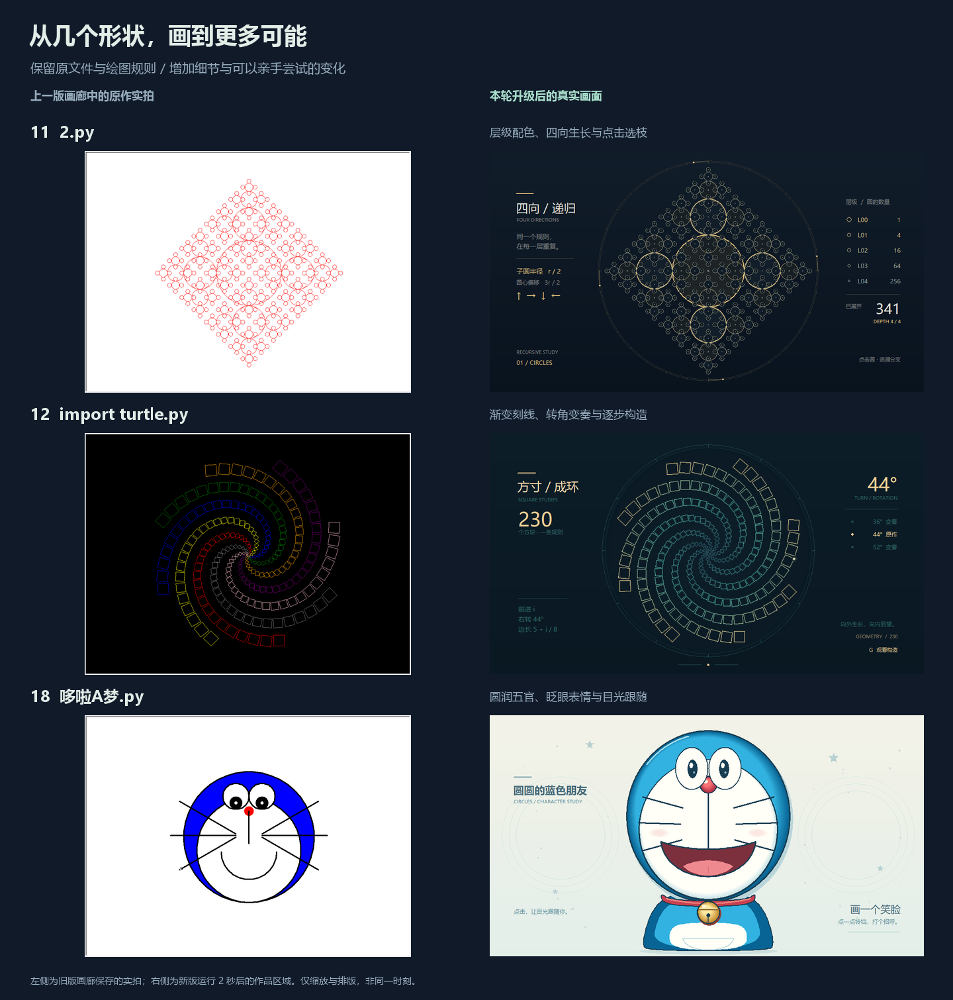
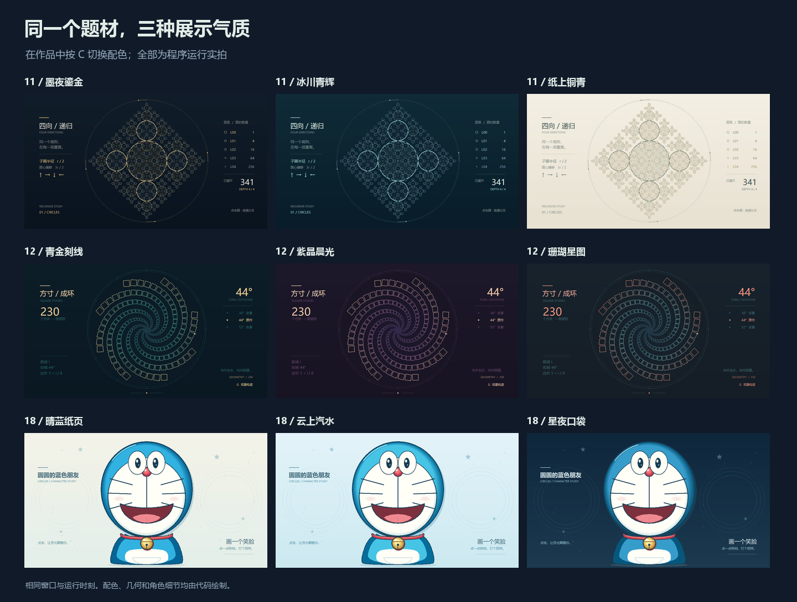

# 原文件继续焕新：圆阵、螺旋与头像

[返回画廊](../README.md) · [上一轮：彩球、太极与时钟](ORIGINAL_MOTION.md) · [全部原作操作](CREATIVE_GUIDE.md#14-个创意原作)

本轮直接升级根目录的 **`2.py`、`import turtle.py`、`哆啦A梦.py`**，保留原有几何规则与角色题材，补充明暗层次、构图和适合现场讲解的互动。文件名、作品编号与“创意原稿”分类继续保留；画廊仍有 **14 款互动展品 + 14 个创意原作，共 28 款**。加上前两轮，已有九份原作接入共用舞台。



左侧使用上一版画廊保存的原作截图，右侧为新版程序运行 2 秒的真实截图；画面只做作品区域裁切、缩放和排版，前后图不代表同一时刻。

## 直接打开原文件

在项目根目录任选一条运行；文件名含空格时需要引号：

```bash
python 2.py
python "import turtle.py"
python 哆啦A梦.py
```

也可运行 `python run.py --demo 11`、`--demo 12` 或 `--demo 18`，或在桌面画廊选择。需要 **Python 3.9+、Tkinter 和桌面显示环境**。作品仅使用标准库，图形由代码绘制，无需网络和外部图片；三份文件依赖 `社团展示/` 共用模块，复制时保留完整项目。导入文件不会自动打开窗口。

## 看点与操作

| 原文件 | 本轮变化 | 专属操作 |
| --- | --- | --- |
| [11 递归圆阵 · 2.py](../2.py) | 四向递归圆加入分层光纹、环形刻度、层级数量与分支提示 | C 配色；↑↓ 深度 0～4；G 逐层重播；点击圆选择该圆及其后续分支 |
| [12 彩色方块螺旋 · import turtle.py](../import%20turtle.py) | 230 个方块组成渐变刻线，带移动光点、转角对照与构造进度 | C 配色；←→ 切换 36° / 44° / 52°；G 或点击画面重播；↑↓ 构造速度 0.25～3 倍 |
| [18 哆啦 A 梦头像 · 哆啦A梦.py](../哆啦A梦.py) | 分层蓝色头部、圆润五官、鼻尖高光、金色铃铛与纸面背景 | C 背景；B 眨眼；M 切换两种笑脸；点击目光跟随；点铃铛轻摇 |

三款通用：**空格暂停/继续 · R 恢复初始状态 · H 隐藏说明 · F11 全屏 · Esc 退出**。键盘操作需要作品窗口获得焦点。暂停时点击不触发互动，G 重播与 B 眨眼也不启动；配色仍可切换。R 会恢复默认配色和作品设置。

圆阵与螺旋打开时先展示完整构图，按 **G** 再观察展开过程。圆阵的默认深度为 4，包含从 L0 到 L4 的 341 个递归节点；右侧显示每层的节点数。点击交叠区域时优先选择半径较小的圆，再比较与圆心的距离；G 重播或改变深度会清除分支选择。深度调整后直接展示该深度的完整构图。

螺旋默认使用原作的 **44°** 转角，另外提供 36° 和 52° 两种变奏。↑↓ 只调整重播时的构造速度；完整图案保留微弱的移动光点。可以先比较三种完整构图，再按 G 观察同一条规则怎样一步步形成图案。

头像会间歇自动眨眼，也可按 B 触发。点击后的目光目标保留 **4 秒**，之后逐渐回正；再次点击更新目标。点击铃铛会让它轻摇 **1.4 秒** 并眨眼，重复点击重新计时。铃铛仅有视觉动画，没有声音。M 在“开怀笑”和“弯弯笑”之间切换；C 调整背景与明暗，角色保持蓝、白、红的基本配色。



| 作品 | 三套配色 |
| --- | --- |
| 递归圆阵 | 墨夜鎏金 · 冰川青辉 · 纸上铜青 |
| 彩色方块螺旋 | 青金刻线 · 紫晶晨光 · 珊瑚星图 |
| 哆啦 A 梦头像 | 晴蓝纸页 · 云上汽水 · 星夜口袋 |

## 从画面讲到代码

### 圆阵：同一条规则，逐层重复

`circle_tree()` 保留原来的四向分支：每个子圆半径为父圆的 `r / 2`，圆心沿上下左右偏移 `1.5 * r`。子圆与父圆相切，每层节点数是上一层的四倍；`path` 记录从根圆到当前节点的分支方向。`select()` 用这个路径找到选中节点及其后续分支，让观众在密集图形中看清一次递归的范围。

`draw_structure()` 按层组织图形，配色、深度、分支或窗口尺寸改变时才重画。逐帧部分仅更新外圈短光弧；`MAX_DEPTH` 将深度限制为 4，控制图形数量。想修改圆阵疏密，可先调整 `circle_tree()` 的位移系数，并观察相切关系如何变化。

### 螺旋：保留 230 步方块规则

`square_geometry()` 按原作顺序生成顶点：第 `i` 步先前进 `i`，再右转指定角度，绘制边长 `5 + i / 8` 的正方形。默认转角仍是 44°。`fit_geometry()` 统一缩放并平移整幅构图，使其适应窗口，同时保留角度和边长比例。

`cache_drawing()` 创建方块底线、主线与短角线，`show_completed()` 在构造重播时改变已有图形的可见性。完整状态不重复生成 230 个方块，动画只更新画笔光点。`ANGLE_PRESETS` 控制三种转角，`PALETTES` 控制从内到外的色彩，`DRAW_RATE` 控制基础构造速度。

### 头像：静态轮廓与局部表情分开

`backdrop()` 绘制纸面、头部、鼻子、胡须和笑脸，通过多层偏移椭圆塑造明暗；这些图形只在背景、表情或窗口变化时重画。`draw_eyes()` 与 `draw_bell()` 更新少量局部图形，避免每次眨眼都重画整张头像。

`pupil_offset()` 将瞳孔位置约束在眼睛内部的椭圆范围。`update()` 按经过时间平滑移动视线、计算点击目标的保留时间和铃铛动画进度；`eye_open()` 控制眨眼时眼睛的开合。可以从瞳孔约束、眨眼时长或两种笑脸曲线开始修改。

## 性能记录与预览维护

[本轮性能记录](benchmarks/original-studies.json)提供运行环境、窗口尺寸、采样方法、逐帧绘制耗时与 Canvas 对象数。计时包含逐帧绘制和 `screen.update()`，用于观察本机绘制成本，不等同于端到端帧率。

Windows / Python 3.12.4 / Tk 8.6.14，1000 × 720 窗口预运行 50 帧后采样 120 帧：

| 作品 | 绘制耗时中位数 | P95 | Canvas 对象数 |
| --- | --- | --- | --- |
| 递归圆阵 | 20.17 ms | 23.18 ms | 1142 |
| 方块螺旋 | 15.17 ms | 17.61 ms | 848 |
| 哆啦 A 梦头像 | 5.69 ms | 7.33 ms | 215 |

已实际检查九套配色、760 × 580 小窗口、三种螺旋转角、圆阵深度与分支选择、头像表情和铃铛反馈。三份原文件直接启动、由 `run.py` 启动与关闭均通过；全套 217 项测试中 216 项通过，1 项可选 GUI 字体检查跳过。网页的作品发现、搜索和手机布局检查也通过。

修改作品后，实际检查三套配色、小窗口、暂停、重置和各自的点击操作；圆阵还需检查深度与分支选择，螺旋检查三种转角与重播，头像检查两种表情及视线回正。然后在 Windows 桌面环境复拍画廊预览：

```bash
python -m pip install -r requirements-media.txt
python tools/render_media.py --original-ids 11 12 18 --compose-originals
python tools/export_gallery.py
python tools/check_catalog.py
```

媒体工具根据 `作品目录.py` 中的 `entry_class` 导入场景，更新三款主预览、两种缩略图与原作总览。Pillow 仅用于可选媒体维护，作品本身不依赖它。这三款仍属于原作集合；创作面板与自动巡展的适用作品见各自指南。
