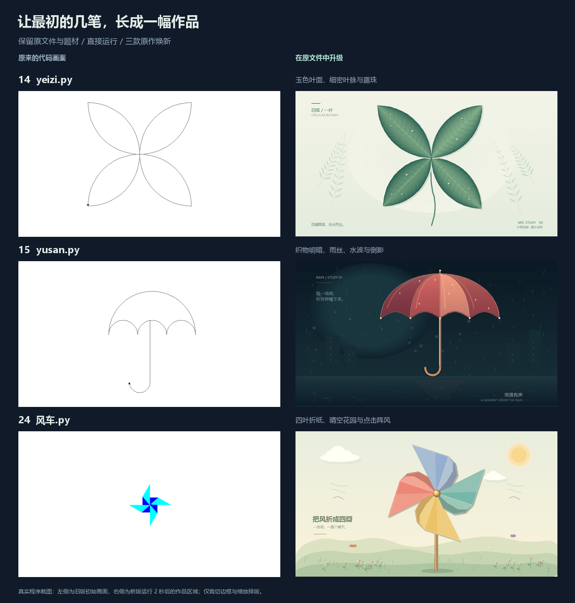
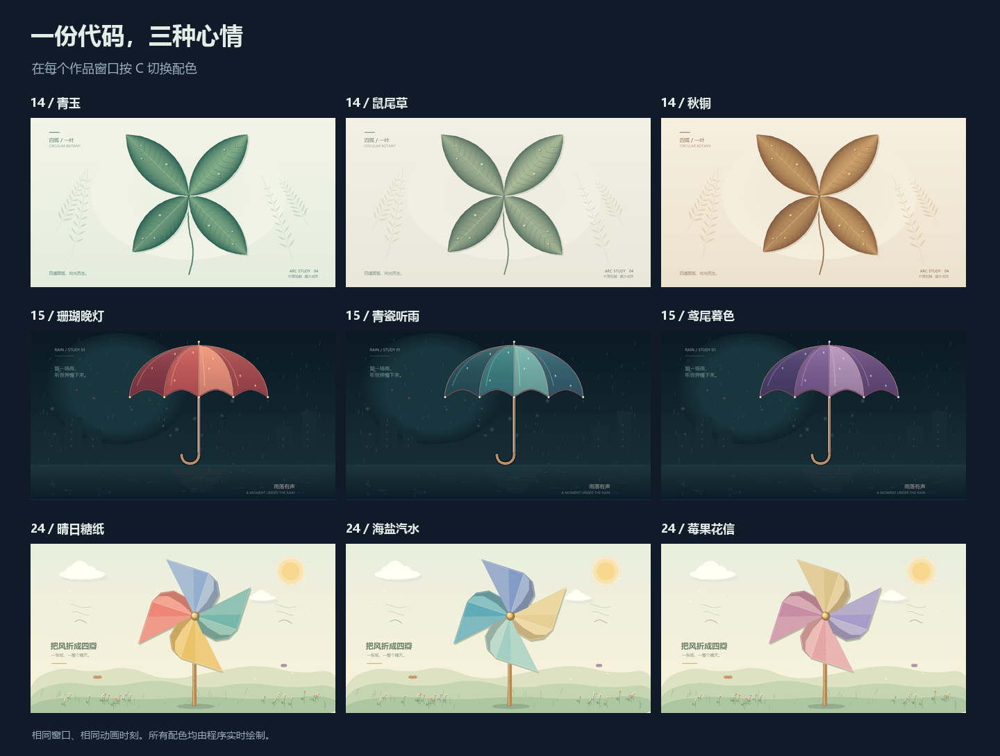

# 原文件焕新：叶子、雨伞与风车

[返回画廊](../README.md) · [原作操作与修改入口](CREATIVE_GUIDE.md#14-个创意原作)

本轮直接优化根目录的 **`yeizi.py`、`yusan.py`、`风车.py`**，保留文件名、编号和原有题材，继续归入画廊的“创意原稿”。早期线稿可在 [升级前的 Git 版本](https://github.com/zjh-b/turtle-gallery/tree/7ae4832) 中查看。



左右均为真实运行截图。左侧是升级前的初始窗口，右侧是新版运行 2 秒后的作品区域；只裁去边框、工具说明并缩放排版。

## 直接打开原文件

在项目根目录任选一条运行：

```bash
python yeizi.py
python yusan.py
python 风车.py
```

也可使用 `python run.py --demo 14`、`--demo 15`、`--demo 24`，或从画廊选择。运行只需 Python 3.9+ 与 Tkinter；这三份文件复用项目的 `社团展示/` 共用模块，复制到其他电脑时请保留完整项目。

## 看点与玩法

| 原文件 | 本轮变化 | 专属操作 |
| --- | --- | --- |
| [14 圆弧叶影 · yeizi.py](../yeizi.py) | 从半圆交叠的轮廓发展出玉色叶面，加入细密叶脉、纸底蕨影与露珠高光；叶片轻轻摆动 | C 三套植物配色；V 隐藏/显示叶脉；点击叶面添一滴露水 |
| [15 圆弧雨伞 · yusan.py](../yusan.py) | 保留圆弧伞顶、凹弧伞沿和弯钩柄，增加织物分片明暗、伞骨、水滴与雨夜倒影 | C 换伞面颜色；↑↓ 调雨量；点击下方水面泛起涟漪 |
| [24 旋转风车 · 风车.py](../风车.py) | 四片有尖角与凹口的折纸叶面、折痕光影、铜色轴心与木杆，背景加入花园、云与微风 | C 换配色；↑↓ 调风速；D 反转；点击画面送来一阵风 |

三款通用：**空格暂停 · R 恢复初始状态 · H 隐藏说明 · F11 全屏 · Esc 退出**。暂停时点击不增加互动效果；配色切换仍可用于比较画面。键盘操作需要作品窗口获得焦点。

叶片露水持续约 2.8 秒，最多同时保留 6 滴；水面点击最多保留 8 组涟漪，约 2.8 秒淡出；风车阵风持续约 3.2 秒，重复点击重新计时。三个场景都限制对象数量，适合持续展示。



## 代码也一起整理

- 三份原文件提供明确的场景类和主程序入口；导入模块不会自动打开窗口。
- 风车使用经过时间更新转角，通过 `ontimer()` 调度，替换原先百万次循环与逐帧清屏。
- 叶脉、雨线、露珠、纸翼等通过共用 `Paint` 更新既有图形；静态背景按窗口尺寸或配色更新缓存。
- 共用舞台支持根目录原作的包导入，同时保留编号脚本的直接运行方式。

想继续改画面，可以从 `yeizi.py` 的 `PALETTES`、`SHADE_BANDS`、`draw_leaf()`，`yusan.py` 的 `SCHEMES`、`rib()`、`scallop()`，以及 `风车.py` 的 `PALETTES`、`BLADE`、`FOLD` 入手。

## 验证与维护

已实际检查 1000 × 720 与 760 × 580 窗口、九套配色、叶脉开关和点击效果；三款分别通过了从项目外目录直接启动、通过 `run.py` 启动以及关闭窗口的检查。回归测试覆盖导入、模块路径、暂停、点击范围、固定对象数量和风车的时间步长一致性。

本机 Windows / Python 3.12.4 / Tk 8.6.14，在默认 1000 × 720 窗口预运行 2 秒后，对 120 次 `frame(0.025)` 加 `screen.update()` 采样：

| 作品 | 绘制耗时中位数 | P95 | Canvas 对象数 |
| --- | --- | --- | --- |
| 圆弧叶影 | 17.99 ms | 20.32 ms | 431 |
| 圆弧雨伞 | 9.62 ms | 11.94 ms | 474 |
| 旋转风车 | 5.86 ms | 7.57 ms | 278 |

这些是本机绘制与 Tk 更新耗时，不是端到端帧率。[测量记录](benchmarks/original-upgrades.json)保留方法与运行环境。

修改后，先实际运行作品，再同步真实预览。在 Windows 桌面环境执行：

```bash
python -m pip install -r requirements-media.txt
python tools/render_media.py --original-ids 14 15 24 --compose-originals
python tools/export_gallery.py
python tools/check_catalog.py
```

复拍已登记 `entry_class` 的原作会更新主预览及两种缩略图；`--compose-originals` 刷新原作总览。Pillow 仅用于这些可选媒体维护工具，作品运行不依赖它。
