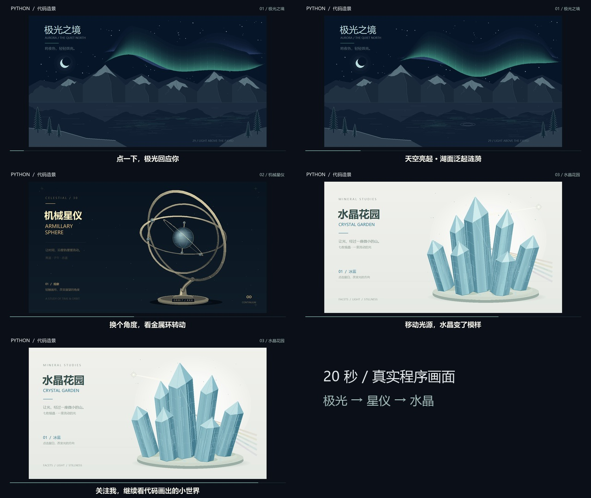

# 代码造景 · 极光、星仪与水晶

[返回画廊](../README.md) · [作品与操作说明](IMMERSIVE_ART.md) · [账号与首集方案](SOCIAL_VIDEO.md)

**已于 2026-10-10 发布至 B 站并通过审核：[我用 Python，画了三个会回应你的世界](https://www.bilibili.com/video/BV1VhpY66EsQ/)。账号「难安这余念」（UID 3546966168438889），稿件 BV1VhpY66EsQ。**

这条内容展示 29 极光之境、30 机械星仪、31 水晶花园的真实程序画面。主发布平台为哔哩哔哩，成片为 **20 秒、1920 × 1080 横版**；主要目标是让观众关注个人账号，继续看代码绘画与互动创作。以下标签只描述题材，不代表热门排名。

## 已完成的发布素材

**[播放 / 下载成片](assets/social-immersive/video.mp4)** · [16:9 封面](assets/social-immersive/cover.png) · [4:3 封面](assets/social-immersive/cover-4x3.png) · [分镜预览](assets/social-immersive/storyboard.jpg) · [中文 SRT](assets/social-immersive/captions.zh.srt) · [制作记录](assets/social-immersive/manifest.json)

成片为 30 fps、600 帧，包含中文字幕与原创程序合成的轻环境音，无口播。画面逐帧捕获自实际 Tk 绘图窗口，以固定时间步推进动画；合成时等比置入横版画面。已用 ffprobe 核对媒体参数，并通过整段解码检查。



## 哔哩哔哩 · 推荐直接使用

### 标题

```text
我用 Python，画了三个会回应你的世界
```

### 视频简介

```text
点一下，极光亮起来，湖面泛起涟漪。
转个角度，金属环从眼前绕过。
挪动光源，水晶换了一副模样。

这是我用 Python 画的三个小世界，每一个都能互动。
关注我，继续看代码画出的小世界。

项目已开源：https://github.com/zjh-b/turtle-gallery
作品编号：29 极光之境 / 30 机械星仪 / 31 水晶花园
三件作品由 Python 标准库实时绘制，在电脑桌面运行即可体验交互。
画面由实际 Python 程序绘制，代码与剪辑文案使用 AI 辅助制作；背景音为程序合成。
```

### 标签

```text
Python,创意编程,代码绘画,编程,极光,视觉艺术
```

### 首条评论

已发布并在作品评论区核对可见（2026-10-10）。

```text
极光、星仪、水晶，你最想亲手点哪一个？也可以留一个你想看到的画面，我会从大家的灵感里挑选后续题材。
```

如观众询问实现方式，可回复：“源码和运行方法在简介里的开源项目，作品编号是 29、30、31。”不把关注、点赞或私信设为查看源码的条件。

## 抖音 · 备用文案

标题、首评可沿用上面的中文版本，正文用下面这一版。当前没有安排向抖音投稿。

```text
点一下，极光亮起来，湖面泛起涟漪。
转个角度，金属环从眼前绕过。挪动光源，水晶换了一副模样。
这是我用 Python 画的三个小世界，每一个都能互动。
关注我，继续看代码画出的小世界。

#Python #代码绘画 #创意编程 #极光 #视觉艺术
```

## TikTok · 备用英文文案

当前没有安排向 TikTok 投稿；英文版字幕与文案留作后续素材。

### Caption

```text
I drew three little worlds with Python.
Tap the sky and the aurora brightens. Turn the view and the metal rings overlap. Move the light and the crystal faces change.

Follow for more interactive art made with code.

#CreativeCoding #Python #GenerativeArt #CodeArt
```

### First comment

```text
Which would you explore first: the aurora, the moving rings, or the crystal garden? Leave a scene you would love to see drawn with code.
```

## 20 秒分镜

先展示完整画面，再让一次操作产生清楚的变化。保留点击前后状态，使用项目实际响应；视频里的点击演示不表示观众能直接点击视频互动。

| 时间 | 真实画面与动作 | 主字幕 | 可选口播 |
| --- | --- | --- | --- |
| 0–2 秒 | 完整极光构图，开场即显示光幕，点击天空 | 点一下，极光回应你 | 点一下，极光回应你。 |
| 2–7 秒 | 极光抬升发亮，随后点击湖面，看波纹扩散 | 天空亮起 · 湖面泛起涟漪 | 天空亮起来，湖面也泛起涟漪。 |
| 7–12 秒 | 切机械星仪，点击改变视角，让环带交叉经过球体 | 换个角度，看金属环转动 | 换个角度，看金属环从眼前绕过。 |
| 12–17 秒 | 切水晶花园，点击两处移动光源，切面明暗改变 | 移动光源，水晶变了模样 | 移动光源，水晶就换了模样。 |
| 17–20 秒 | 水晶继续缓慢变化，保持主体与结尾文字稳定 | 关注我，继续看代码画出的小世界 | 关注我，继续看代码画出的小世界。 |

本次成片已经带有原创程序合成的轻环境音，没有口播、采样或外部音乐录音。上表口播只供后续配音参考，不属于当前音轨。

### 备用英文字幕文案（未制成英文版视频）

| 时间 | 字幕 |
| --- | --- |
| 0–2 秒 | Tap the sky. Watch it respond. |
| 2–7 秒 | Aurora above. Ripples below. |
| 7–12 秒 | A new angle on moving rings. |
| 12–17 秒 | Move the light. Watch the facets change. |
| 17–20 秒 | Three worlds, drawn with Python. / Follow for more code art. |

## 封面文字

| 位置 | 中文 | English |
| --- | --- | --- |
| 主标题 | 代码里的三个小世界 | Three worlds in code |
| 副标题 | 极光 · 星仪 · 水晶 | Aurora · Rings · Crystals |
| 系列标识 | Python 互动绘画 | Interactive Python Art |

封面使用实际绘图截图，以极光为主画面，另两件作品作为小幅预览。主标题优先保证手机上可读，作品名放在副标题；勿用不存在于成片的画面作为封面。

## 重新制作

需要 Windows 桌面、Python / Tkinter、Pillow 与 FFmpeg。先安装 Pillow，并让 `ffmpeg` 可从 PATH 找到；或在最后一条命令追加 `--ffmpeg` 指定可执行文件路径。在项目根目录依次运行：

```bash
python tools/capture_immersive_video.py --work 29 --seconds 7 --fps 30 --output exports/immersive-take-02/29
python tools/capture_immersive_video.py --work 30 --seconds 5 --fps 30 --output exports/immersive-take-02/30
python tools/capture_immersive_video.py --work 31 --seconds 8 --fps 30 --output exports/immersive-take-02/31
python tools/render_immersive_video.py --captures exports/immersive-take-02 --output exports/immersive-take-02/movie
```

每条命令的输出目录必须尚不存在；重录时更换 `immersive-take-02` 这一目录名。录制三件作品时依次打开窗口，期间不要关闭、调整窗口大小或手动操作画面，脚本会完成演示并自动关闭自己的窗口。

动画按固定 `dt = 1 / fps` 推进，每帧保存真实画面；录制实际耗时与成片片长无关，保存较慢不会加长最终 20 秒视频。合成前会核对帧数与源码哈希；修改作品后需重新录制，不能直接复用旧帧。

## 两个备用开场

- 偏互动：“这三幅画，都能回应你的点击。”配合标题“用 Python 做了三个可以玩的画面”。
- 偏氛围：“把极光、星仪和水晶，放进一段代码里。”配合标题“代码也能画出这样的光”。

一次发布选一套开场与标题即可，正文和关注方向保持一致。后续选题依据实际留言调整，不承诺每条建议都会制作，也不预设下集题材或日期。

## 发布记录

| 平台 | 账号 | 状态 | 公开链接 |
| --- | --- | --- | --- |
| 哔哩哔哩 | 难安这余念 / UID 3546966168438889 | 已提交并通过审核，播放页可访问 | [BV1VhpY66EsQ](https://www.bilibili.com/video/BV1VhpY66EsQ/) |
| 抖音 | 未指定 | 备用，未提交 | 尚无 |
| TikTok | 未指定 | 备用，未提交 | 尚无 |

稿件管理显示“已通过 1”，播放页返回 HTTP 200，标题及作者 UID 均已核对；首评已发布并确认可见。平台创作声明选择“含 AI 生成内容”，简介说明实际程序绘制及 AI 辅助制作；本地视频实测为 20.000 秒，B 站页面时长显示为 21 秒。后续效果以真实后台数据为准。
