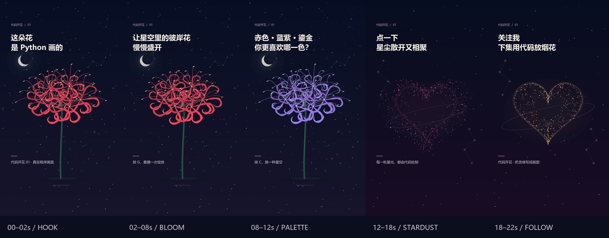

# 可重复生成的竖屏短片

[返回画廊](../README.md) · [抖音 / TikTok 视频方案](SOCIAL_VIDEO.md) · [展示与 PNG 导出](EXHIBITION_GUIDE.md)

`tools/render_video.py` 将 **25 星空彼岸花、26 怦然心动** 的真实绘图指令按固定时间步重新绘制，再流式交给 FFmpeg 编码。它是独立的素材制作工具，作品窗口的创作面板仍提供 PNG 导出。

首支样片为 **22 秒、9:16、1080 × 1920、30 fps** 的「代码开花 01」，目标是让观众关注个人账号、期待下一集。提供中文字幕成片、无字素材、中英文 SRT、封面和分镜图，全部无音轨，便于在发布端选择配乐。具体分镜、口播、发布文案和后续三集见[视频方案](SOCIAL_VIDEO.md)。

**[观看中文字幕样片](assets/social-01/video.mp4)** · [无字素材](assets/social-01/clean.mp4) · [封面](assets/social-01/cover.png) · [中文字幕](assets/social-01/captions.zh.srt) · [英文字幕](assets/social-01/captions.en.srt)



## 生成自己的素材包

正常运行画廊不需要这些依赖。制作视频时安装可选 Pillow，并准备包含 `libx264` 的 FFmpeg；可从 [FFmpeg 官方下载页](https://ffmpeg.org/download.html)找到系统对应的安装包来源。工具只使用本机可执行文件，不会自动下载编码器。

```bash
python -m pip install -r requirements-video.txt
ffmpeg -version
python tools/render_video.py --output exports/social-01 --account "@你的账号"
```

`--account` 可省略。署名最多 24 字，字号会按可用宽度缩小；这里是视频中的文字，不会连接或登录社交账号。

| 参数 | 用途 |
| --- | --- |
| `--output exports/social-01` | 输出到一个尚不存在的目录；已有目录会被拒绝，保留旧成片 |
| `--width 720` / `1080` | 对应 720 × 1280 / 1080 × 1920；默认 1080 |
| `--fps 24` / `30` | 固定帧率，默认 30；全片分别 528 / 660 帧 |
| `--language zh` / `en` | 烧录到成片与封面的语言；两份 SRT 都会生成 |
| `--account "@你的账号"` | 在底部留白中加入账号署名 |
| `--ffmpeg "C:/工具/ffmpeg.exe"` | 指定已安装的 FFmpeg 路径 |
| `--font` / `--font-bold` | 指定可用的中英文 TrueType 字体；自选常规字体时粗体默认共用该文件 |

快速生成一份英文预览：

```bash
python tools/render_video.py --output exports/social-01-en --width 720 --fps 24 --language en
```

默认读取 Windows 微软雅黑。绘制过程中不创建 Tk 窗口；Python 仍需能够导入项目依赖的 Tkinter。自选字体可用于其他系统，但目前整条视频制作流程仅在 Windows 实测。请使用有相应使用许可的字体，字体文件不随素材包分发。

## 输出文件

| 文件 | 内容 |
| --- | --- |
| `video.mp4` | 带所选语言字幕与系列标题的 H.264 / yuv420p 成片，无音轨 |
| `clean.mp4` | 同步的真实作品动画，移除作品题字与视频字幕，便于重新剪辑 |
| `cover.png` | 与视频同尺寸的独立封面 |
| `captions.zh.srt` / `captions.en.srt` | 5 段字幕，时间范围 0–22 秒；用于无字素材，避免与成片重复叠字 |
| `storyboard.jpg` | 五个代表时刻的分镜联系图 |
| `manifest.json` | 输出尺寸、帧率、初始配方、预热帧数、输入事件、源码与文件哈希 |

RGB 帧直接送入两个编码进程，不需要先在磁盘保存数百张 PNG。编码使用 `+faststart` 调整 MP4 的元数据位置，便于网络播放；相关格式说明见 [FFmpeg MP4 文档](https://ffmpeg.org/ffmpeg-formats.html#mov_002c-mp4_002c-ismv)。

工具在同级临时目录中完成全部产物后才发布输出目录。按 Ctrl+C、编码失败或目标目录已存在时，不替换旧成片；常规取消会结束本工具启动的编码进程。强制终止 Python 或系统断电可能留下 `.gallery-video-*` 临时目录，确认任务已经停止后再清理对应目录。

## 怎样持续迭代

1. **改文案与账号**：字幕与标题在 `tools/render_video.py` 的 `COPY` 中；`--account` 只影响署名。
2. **改节奏**：`SHOTS` 定义五个连续镜头，`inputs()` 记录重播、换色、流星和点击散开的帧号；调整事件时检查两种帧率。
3. **改画面**：`produce()` 中的两个初始参数字典通过作品原有参数校验，随机种子固定。渲染调用真实 `frame(dt)`，没有单独复制花瓣或粒子算法。
4. **复现问题**：保留 `manifest.json`，比较尺寸、fps、配方、字体与源码哈希。同版本、同字体、同依赖下检查相同帧；不承诺跨 Python、Pillow、FFmpeg 或字体版本的逐字节一致。
5. **检查结果**：完整播放成片，检查展开和回聚有没有完成；使用发布端预览检查文字是否被按钮、昵称或描述遮挡。工具的留白是制作选择，不是所有平台界面的统一安全区。

仓库测试会检查已发布素材及其源文件的哈希。修改相关绘图源码或视频工具后，请输出到一个新的本地目录，验收后将完整素材包同步到 `docs/assets/social-01/`，再提交。字幕以 UTF-8 / LF 保存，与 Git 的换行规则一致；源码哈希将 CRLF 统一为 LF 后计算，避免 Windows 工作区与仓库换行差异导致误报，其余源码字节均保留。

```bash
python -m unittest discover -s tests -p "test_video*.py" -v
ffprobe -v error -select_streams v:0 -show_entries stream=codec_name,width,height,r_frame_rate,nb_frames,duration -of json exports/social-01/video.mp4
ffmpeg -v error -i exports/social-01/video.mp4 -f null -
```

当前限制：仅支持这个 25/26 双作品脚本、两档竖屏尺寸和两档帧率；暂不读取任意外部视频脚本、不录制鼠标历史、不添加音轨、不提供创作面板 MP4 按钮。后续接入作品时，先验证其离屏绘图和输入接口，再增加镜头。

## 本轮检查

2026-10-08 在 Windows 11、Python 3.12.4、Pillow 12.3.0、FFmpeg 8.1.2 上生成中文 1080 × 1920 / 30 fps 与英文 720 × 1280 / 24 fps 的成片和无字素材。四份文件均完整解码通过，分别为 660 / 528 帧、22 秒、H.264 / yuv420p、无音轨；素材与源码哈希匹配。中文成片在无界面 Edge 中连续播放至 22 秒，浏览器记录 660 个视频帧并正常结束。全套 268 项测试中 267 项通过、1 项可选 GUI 字体检查跳过。再次指定已有输出目录会被拒绝，原产物哈希保持不变。详见[实际检查记录](benchmarks/video-m2.json)。
