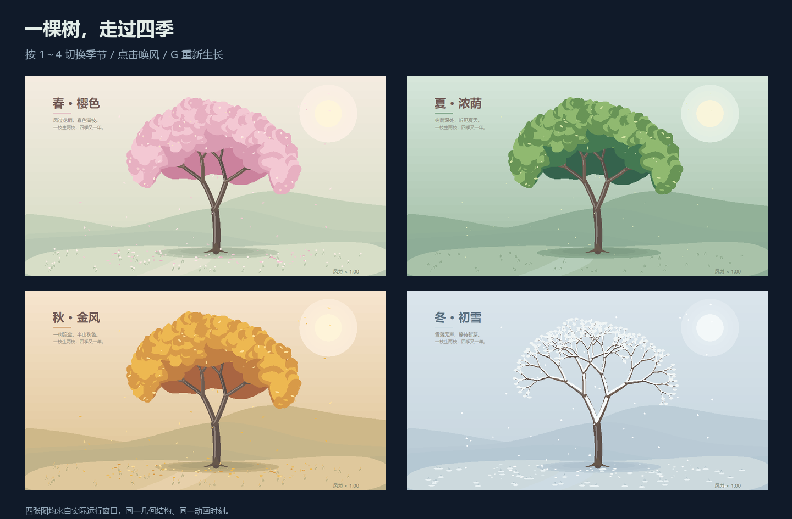

# 三款作品的画面升级

[返回画廊](../README.md) · [全部互动作品玩法](../社团展示/README.md)

本轮精修 02 星系、06 四季树和 09 几何绘图仪，增加主体细节、前后层次与现场互动。图形由 Python / Turtle / Tkinter 实时绘制，运行作品只需标准库。


对照来自真实 Windows 窗口：两版均使用 1000 × 720 窗口，重置后推进 2 秒；09 两侧均选择“二十瓣织锦”。旧版对应提交 `aa6d4e3`。图片仅裁切、缩放和排版。

## 打开展示

在项目根目录任选一条命令运行：

```bash
python run.py --demo 02
python run.py --demo 06
python run.py --demo 09
```

进入作品后按 **F11** 全屏，**H** 隐藏或恢复说明，**空格** 暂停，**R** 重来，**Esc** 退出。

| 作品 | 画面变化 | 现场玩法 |
| --- | --- | --- |
| [02 口袋里的宇宙](../社团展示/02_旋转星系.py) | 弥散星云与星尘、弯曲日冕、朝向太阳的球面明暗、地球云层、环形山与九层土星环；近远行星保持遮挡关系 | 点击土星观察选中光环；O 隐藏轨道，↑↓ 调速。比例与运动是艺术化示意 |
| [06 一树四季](../社团展示/06_四季分形树.py) | 层叠树冠、树皮明暗、远山与草地、落花与积雪；春夏秋冬各有配色和细节 | 1～4 换季，点击左右两侧唤起不同方向的阵风，G 从树干逐层生长；S 下一季，↑↓ 风力 |
| [09 圆在画花](../社团展示/09_几何绘图仪.py) | 五层发光曲线、细刻度圆盘、移动画笔光迹；默认呈现二十瓣织锦 | 1～4 选花型，P 换配色，L 单线/叠层，C 重绘，G 查看滚圆机构，↑↓ 调速 |

绘图仪的五层纹样来自同一条内旋轮线的缩放与旋转副本。讲解数学原理时，可按 **L** 显示单线，再按 **G、C** 看偏心画笔如何描出原始曲线。P、L、G 不会重置绘制进度。



四季树的一次阵风持续约 3.6 秒，重复点击会重新计时；暂停时点击不触发阵风。枝条与飘落花叶使用固定数量的对象，持续互动不会不断追加粒子。

## 画面与性能检查

已实际检查 1000 × 720 与 760 × 580 窗口、四季外观、四种曲线、三套配色、点选星球，以及单线 / 圆盘 / 重绘的组合操作。新增回归测试覆盖星系遮挡、点击阵风、固定对象数量、曲线精度、缓存失效和暂停帧状态。

绘图仪保留每条原始曲线的 1601 个采样点，按窗口比例简化显示折线。被省略的原始顶点到显示线段的距离不超过 **0.3 像素**；完整图案复用已绘制轨迹。星系和树木缓存静态背景，换季或改变窗口尺寸时更新。

以下为 2026-10-01 的单机记录，环境为 Windows 11、Python 3.12.4、Tk 8.6.14。每款使用默认设置与 1000 × 720 窗口，先推进 50 次 `frame(0.04)`，再采样 120 次 `frame(0.025)` 加 `screen.update()` 的耗时。

| 作品 | 中位数 | P95 | Canvas 对象数 |
| --- | --- | --- | --- |
| 02 星系 | 30.15 ms | 42.72 ms | 1047 |
| 06 四季树（春季） | 30.56 ms | 36.32 ms | 1072 |
| 09 绘图仪（完整五层图案） | 16.95 ms | 24.02 ms | 262 |

这些数字是本机绘制与 Tk 更新的耗时，不是端到端帧率，也不代表其他设备、全屏尺寸或重绘中的性能。[查看原始测量记录](benchmarks/visual-upgrades.json)。

## 继续改画面

- **02**：`make_nebula()` 调整星云走向，`draw_sun()` 调日冕，`sphere()` / `ring()` 调行星与星环。
- **06**：`CROWN_COLORS` 调树冠层次，`crown()` 调枝叶形状，`background()` 调山景，`blow()` 调点击阵风。
- **09**：`PALETTES` 调三套色彩，`LAYERS` 调缩放与转角，`PRESETS` 调内旋轮线参数。

改完后运行相关测试并打开实际窗口，尤其检查最小窗口、连续交互及长时间运行。确认画面后，在 Windows 桌面环境安装可选媒体依赖并刷新预览：

```bash
python -m pip install -r requirements-media.txt
python tools/render_media.py --exhibits 2 6 9 --gif
python tools/export_gallery.py
python tools/check_catalog.py
```

这会同步桌面卡片、网页图片与 README 展示动画。[维护说明](CONTRIBUTING.md#更新展示图片)提供其他媒体生成入口。
